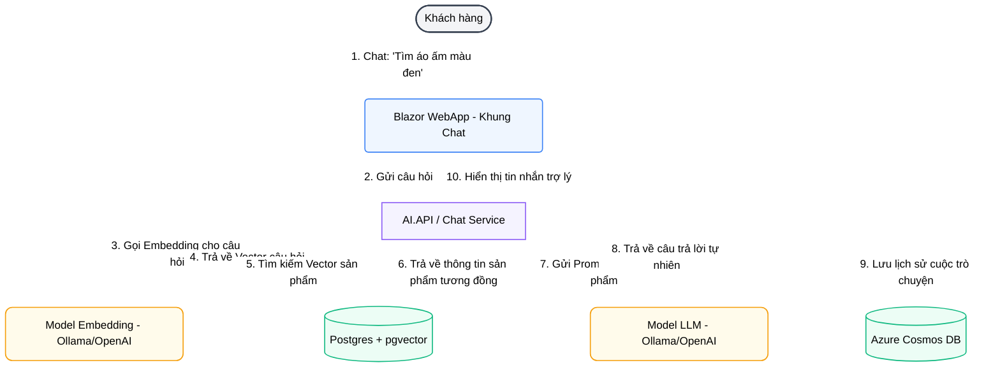

```mermaid
%%{init: {'theme': 'neutral', 'themeVariables': { 'lineColor': '#000000' }}}%%
flowchart TD
    classDef startEnd fill:#F3F4F6,stroke:#374151,stroke-width:2px,color:#000000,rx:10px;
    classDef worker fill:#EFF6FF,stroke:#3B82F6,stroke-width:1.5px,color:#000000,rx:5px;
    classDef db fill:#ECFDF5,stroke:#10B981,stroke-width:1.5px,color:#000000;
    classDef event fill:#F5F3FF,stroke:#8B5CF6,stroke-width:1.5px,color:#000000;

    subgraph VoucherFlow ["LUỒNG ĐỔI VOUCHER"]
        Exchange[Khách đổi 100 điểm tích lũy] --> DeductPoints[1. Trừ điểm tích lũy trong DB]
        DeductPoints --> GenerateVoucher[2. Sinh mã Voucher & hạn dùng]
        GenerateVoucher --> SaveVoucher[3. Lưu Voucher vào discountdb]
    end

    subgraph DecayFlow ["LUỒNG HẠ HẠNG TỰ ĐỘNG (HÀNG ĐÊM)"]
        Scheduler([Quartz.NET / Hosted Service]) -->|Trigger lúc 00:00| ScanUser[1. Quét khách hàng 6 tháng không mua sắm]
        ScanUser --> CheckUser{Có khách hàng nào?}
        CheckUser -- Yes --> Downgrade[2. Trừ điểm tích lũy / Hạ 1 cấp Rank]
        Downgrade --> UpdateCache[3. Cập nhật Redis Cache để đồng bộ]
        CheckUser -- No --> EndDecay([Hoàn tất quét])
    end

    class Scheduler,EndDecay startEnd;
    class Exchange,Downgrade worker;
    class DeductPoints,SaveVoucher,ScanUser db;
    class UpdateCache event;
    
    linkStyle default stroke:#000000,stroke-width:2px;
```

```mermaid
%%{init: {'theme': 'neutral', 'themeVariables': { 'lineColor': '#000000' }}}%%
flowchart TD
    classDef startEnd fill:#F3F4F6,stroke:#374151,stroke-width:2px,color:#000000,rx:10px;
    classDef component fill:#EFF6FF,stroke:#3B82F6,stroke-width:1.5px,color:#000000,rx:5px;
    classDef db fill:#ECFDF5,stroke:#10B981,stroke-width:1.5px,color:#000000;
    classDef telemetry fill:#FFFBEB,stroke:#F59E0B,stroke-width:1.5px,color:#000000;
    classDef chaos fill:#FEE2E2,stroke:#EF4444,stroke-width:1.5px,color:#000000;

    subgraph Observability ["LUỒNG ĐO LƯỜNG (TELEMETRY)"]
        APIs[eShop Microservices] -->|1. OTLP Logs / Metrics / Traces| Collector[Prometheus & Aspire OTel Collector]
        Collector -->|2. Thu thập và trực quan| Grafana[Grafana Dashboards]
    end

    subgraph ChaosTesting ["LUỒNG CHAOS ENGINEERING"]
        Tester([Kiểm thử viên]) -->|1. Kích hoạt Fault Injection| ChaosEndpoint[API Chaos Controller]
        ChaosEndpoint -->|2. Bơm lỗi: Latency + 500 Error| TargetAPI[Discount.API]
        WebApp[WebApp / Ordering.API] -->|3. Gọi tới| TargetAPI
        WebApp -.->|4. Kích hoạt Polly Resilience: Retry / Circuit Breaker| WebApp
        WebApp -->|5. Trả về kết quả dự phòng - Fallback| User([Người dùng])
    end

    class Tester,User startEnd;
    class APIs,TargetAPI,WebApp,ChaosEndpoint component;
    class Collector,Grafana telemetry;
    class ChaosEndpoint chaos;
    
    linkStyle default stroke:#000000,stroke-width:2px;
```

# Lộ trình Nâng cấp Hệ thống eShop: AI, Loyalty & DevOps/Chaos Testing (Thứ tự: 1 - 3 - 2)

Tài liệu này mô tả chi tiết kế hoạch thiết kế và triển khai 3 dự án nâng cấp lớn cho hệ thống eShop theo thứ tự ưu tiên: **Dự án 1 (AI Assistant & RAG)** ➔ **Dự án 3 (Loyalty Upgrade & Voucher)** ➔ **Dự án 2 (DevOps & Chaos Testing)**.

---

## DỰ ÁN 1: 🤖 Trợ lý Ảo Mua Sắm AI (RAG & Cosmos DB)
**Mục tiêu:** Xây dựng một Chatbot AI tư vấn sản phẩm thông minh, có khả năng tìm kiếm ngữ nghĩa sản phẩm và ghi nhớ lịch sử hội thoại của từng người dùng.

### 1. Sơ đồ luồng dữ liệu (Data Flow)

### 2. Các bước triển khai chi tiết
* **Bước 1.1: Đăng ký Cosmos DB & Ollama/OpenAI vào AppHost**
  * Tích hợp `.AddCosmosDb("cosmos")` vào `eShop.AppHost` để chạy Cosmos DB Emulator cục bộ.
  * Tích hợp tài nguyên Ollama (`.AddOllama("ollama")`) để kéo model `all-minilm` (tạo vector) và `llama3`/`phi3` (chat).
* **Bước 1.2: Xây dựng AI/Chat Service (`AI.API` hoặc tích hợp trong `Catalog.API`)**
  * Cài đặt thư viện `Microsoft.Extensions.AI` để trừu tượng hóa các cuộc gọi LLM.
  * Thực hiện chức năng **Vector Search**: Nhận câu hỏi ➔ Chuyển thành vector qua `IEmbeddingGenerator` ➔ Dùng EF Core + pgvector query DB `catalogdb` lấy sản phẩm có khoảng cách `<=>` ngắn nhất.
* **Bước 1.3: Lưu trữ lịch sử cuộc hội thoại vào Cosmos DB**
  * Định nghĩa cấu trúc document lưu trữ cuộc gọi: `SessionId`, `UserId`, `Messages` (User/Assistant), `Timestamp`.
  * Thực hiện ghi chép (Append) lịch sử chat sau mỗi câu trả lời của AI.
* **Bước 1.4: Xây dựng giao diện Chatbot ở WebApp**
  * Thiết kế component Razor `AIChatBubble.razor` dạng bong bóng chat nổi ở góc phải màn hình WebApp.
  * Tạo kết nối thời gian thực bằng SignalR (hoặc HTTP Polling đơn giản) để truyền nhận tin nhắn mượt mà.

---

## DỰ ÁN 3: 🎫 Nâng cấp Hệ thống Loyalty & Đổi Voucher
**Mục tiêu:** Chuyển đổi cơ chế tự giảm giá trực tiếp thành cơ chế tích lũy điểm thưởng linh hoạt, cho phép đổi điểm lấy mã giảm giá (Voucher) và tự động tụt hạng nếu khách hàng không duy trì mua sắm.

### 1. Sơ đồ luồng dữ liệu (Data Flow)

### 2. Các bước triển khai chi tiết
* **Bước 3.1: Nâng cấp thực thể dữ liệu trong `discountdb`**
  * Sửa đổi bảng `CustomerLoyalty` để lưu trữ cột `LoyaltyPoints` (Điểm số hiện tại) và `LastPurchaseDate` (Thời gian mua hàng gần nhất).
  * Tạo bảng mới `Voucher` gồm các cột: `Code` (Primary Key), `CustomerId`, `DiscountAmount`, `IsUsed`, `ExpiryDate`.
* **Bước 3.2: Phát triển API Đổi điểm (Claim Points)**
  * Tạo Endpoint `/api/v1/discount/exchange` cho phép khách hàng nhấn nút đổi 100 điểm tích lũy lấy 1 Voucher trị giá $10.
  * Thiết lập logic xác thực và ghi nhận dữ liệu giao dịch đồng thời xuống DB.
* **Bước 3.3: Áp dụng Voucher tại giỏ hàng**
  * Sửa đổi trang Checkout của WebApp để hiển thị ô nhập mã giảm giá.
  * Tích hợp kiểm tra tính hợp lệ của Voucher (Đúng chủ nhân? Chưa sử dụng? Chưa hết hạn?) trong `Discount.API` trước khi áp dụng chiết khấu.
* **Bước 3.4: Xây dựng Worker hạ hạng tự động (Rank Decay)**
  * Cài đặt thư viện `Quartz.AspNetCore` hoặc sử dụng một `BackgroundService` chạy ngầm.
  * Thiết lập lịch quét định kỳ hàng đêm: Tính khoảng cách giữa thời gian hiện tại và `LastPurchaseDate`. Nếu `TimeSpan > 180 ngày`, tự động trừ điểm và cập nhật hạng mới (Ví dụ hạ từ VIP xuống Diamond) trong Postgres và Redis Cache.

---

## DỰ ÁN 2: 📊 DevOps, Observability & Chaos Testing
**Mục tiêu:** Giám sát hiệu năng hệ thống chuyên sâu qua Grafana và thực nghiệm kiểm thử khả năng chịu lỗi (Resilience) của microservices bằng cách chủ động bơm lỗi (Chaos Engineering).

### 1. Sơ đồ luồng dữ liệu (Data Flow)

### 2. Các bước triển khai chi tiết
* **Bước 2.1: Tích hợp Prometheus và Grafana vào AppHost**
  * Thêm dịch vụ Prometheus và Grafana vào `eShop.AppHost`.
  * Cấu hình file `prometheus.yml` để thu thập dữ liệu chỉ số (Metrics) từ cổng `eShop.ServiceDefaults` của toàn bộ các API con.
  * Thiết lập một Grafana Dashboard mẫu hiển thị: Tốc độ xử lý (TPS), tỷ lệ lỗi HTTP 5xx, và thời gian phản hồi (P95/P99).
* **Bước 2.2: Xây dựng API Bơm lỗi (Fault Injection Controller)**
  * Tạo một Controller chuyên dụng `/api/v1/chaos` trong `Discount.API` (hoặc `Catalog.API`).
  * Endpoint này cho phép bật/tắt các cấu hình thử nghiệm lỗi như:
    * `enableLatency` (khiến API bị chậm ngẫu nhiên từ 3-8 giây).
    * `enableFailure` (khiến API trả về HTTP 500 ngẫu nhiên với tỷ lệ 30%).
* **Bước 2.3: Thử nghiệm thực tế khả năng chịu lỗi (Resilience Verification)**
  * Bật chế độ lỗi latency hoặc failure ở `Discount.API`.
  * Thực hiện quy trình mua sắm trên WebApp và quan sát trên Grafana & Jaeger:
    * Kiểm tra xem cơ chế **Polly Retry** ở WebApp có tự động gọi lại khi gặp lỗi 500 không.
    * Kiểm tra xem **Circuit Breaker** có tự động ngắt kết nối sang `Discount.API` khi lỗi dồn dập, để bảo vệ WebApp không bị treo (bằng cách hiển thị giá trị mặc định cho khách hàng) hay không.
    * Đánh giá hiệu quả phục hồi của hệ thống.
