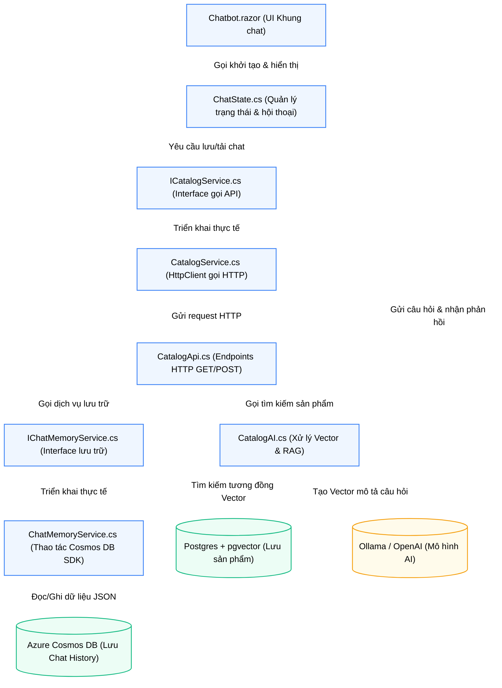
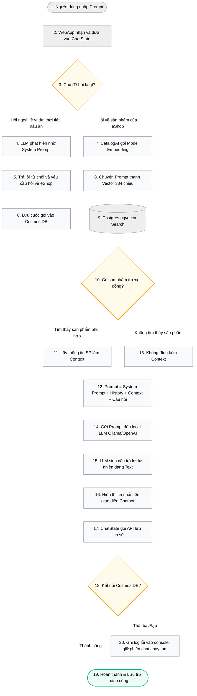

# Báo cáo Chi tiết Kiến trúc & Luồng chạy Trợ lý AI (RAG & Cosmos DB Chat Memory)

Tài liệu này giải thích chi tiết luồng xử lý câu hỏi của người dùng (Prompt Flow), cấu trúc liên kết các tệp tin (File Dependency) và các thay đổi ở giao diện người dùng (UI) đối với Dự án 1 (Trợ lý ảo AI).

---

## 1. Sơ đồ liên kết Tệp tin (File Dependency Diagram)

Sơ đồ dưới đây thể hiện mối quan hệ gọi nhau giữa các file từ giao diện người dùng (Frontend) đến các dịch vụ xử lý và cơ sở dữ liệu (Backend):

### Chi tiết vai trò của từng tệp:
1. **[Chatbot.razor](file:eShop-main/src/WebApp/Components/Chatbot/Chatbot.razor) (UI):** Component Blazor hiển thị giao diện bong bóng chat.
2. **[ChatState.cs](file:eShop-main/src/WebApp/Components/Chatbot/ChatState.cs) (State Manager):** Giữ danh sách tin nhắn hiện tại, quyết định khi nào cần gọi API tải lịch sử hoặc gửi tin nhắn mới lên LLM.
3. **[ICatalogService.cs](file:eShop-main/src/WebAppComponents/Services/ICatalogService.cs) & [CatalogService.cs](file:eShop-main/src/WebAppComponents/Services/CatalogService.cs) (API Client):** Thực hiện cuộc gọi HTTP Client từ WebApp sang `Catalog.API`.
4. **[CatalogApi.cs](file:eShop-main/src/Catalog.API/Apis/CatalogApi.cs) (API Controller):** Tiếp nhận các endpoint `/api/catalog/chat/sessions/...` từ WebApp gửi sang.
5. **[IChatMemoryService.cs](file:eShop-main/src/Catalog.API/Services/IChatMemoryService.cs) & [ChatMemoryService.cs](file:eShop-main/src/Catalog.API/Services/ChatMemoryService.cs) (Cosmos Repository):** Sử dụng thư viện SDK `Microsoft.Azure.Cosmos` để kết nối và thực thi các câu lệnh với database `chatdb`.

---

## 2. Luồng chạy Chi tiết của một câu Prompt (Prompt Data Flow)

Dưới đây là biểu đồ mô tả vòng đời của một câu Prompt từ khi khách hàng nhập vào cho đến khi trả về kết quả và lưu lịch sử:

### Các điều kiện chuyển giai đoạn (Conditions):

1. **Điều kiện Phân loại Chủ đề (CheckTopic - Bước 3):**
   * **Cách thức:** LLM dựa vào **System Prompt** được cấu hình cứng trong `ChatState.cs`: *"You are an AI customer service agent for the online retailer AdventureWorks. You NEVER respond about topics other than AdventureWorks..."*
   * **Kết quả:** Nếu người dùng hỏi các câu hỏi không liên quan, LLM sẽ từ chối trả lời sản phẩm và yêu cầu quay lại chủ đề AdventureWorks.
2. **Điều kiện Tìm kiếm sản phẩm (MatchCheck - Bước 10):**
   * **Cách thức:** Sử dụng EF Core với toán tử `<=>` (khoảng cách cosine) của `pgvector` để tìm các sản phẩm có khoảng cách nhỏ nhất.
   * **Kết quả:** Nếu tìm thấy sản phẩm tương đồng, chúng sẽ được chèn vào prompt dưới dạng ngữ cảnh bổ sung để LLM đọc và trả lời. Nếu không tìm thấy, LLM sẽ tự đưa ra câu trả lời là không tìm thấy sản phẩm nào trong kho.
3. **Điều kiện Lưu Cosmos DB (CosmosResult - Bước 18):**
   * **Cách thức:** Gọi `UpsertItemAsync` bằng SDK. Phân vùng dữ liệu (Partition Key) theo `UserId`.
   * **Nếu thành công:** Dữ liệu lịch sử chat được lưu trữ vĩnh viễn trong Cosmos DB Emulator.
   * **Nếu thất bại (Emulator chưa bật hoặc lỗi mạng):** Hệ thống bắt lỗi (try-catch) trong `ChatState.cs` và ghi log lỗi, đảm bảo khung chat **không bị treo/sập** và khách hàng vẫn tiếp tục trò chuyện được trong phiên hiện tại.

---

## 3. Giao diện (UI) đã thay đổi những gì?

Các cải tiến trực quan trên giao diện Blazor WebApp bao gồm:

1. **Đồng bộ hóa Trạng thái Khởi động (`OnInitializedAsync`):**
   * Trước đây, component `Chatbot.razor` khởi tạo và hiển thị khung chat ngay lập tức với danh sách tin nhắn trống.
   * Hiện tại, phương thức `OnInitializedAsync()` đã được chuyển thành bất đồng bộ (`async Task`). Khi component được tải, nó sẽ gọi `await chatState.InitializeAsync()` để kiểm tra xem user này đã có lịch sử chat trong Cosmos DB trước đó chưa. Nếu có, toàn bộ cuộc hội thoại cũ sẽ được vẽ lại trên giao diện.
2. **Phân vùng Phiên chat (Session & User Resolution):**
   * UI tự động nhận diện tài khoản đăng nhập của người dùng qua `AuthenticationStateProvider`.
   * Nếu người dùng đăng nhập là **Alice** ➔ Lấy `sub` claim làm `UserId`.
   * Nếu là khách vãng lai (chưa đăng nhập) ➔ Sinh mã ngẫu nhiên dạng `guest-{Guid}` để lưu tạm phiên chat cho đến khi tải lại trang.
3. **Hiển thị Tin nhắn Thời gian thực:**
   * Sau khi người dùng nhấn gửi, UI hiển thị biểu tượng loading ("AI is typing...") trong khi chờ LLM sinh câu trả lời. Ngay sau khi Ollama phản hồi, tin nhắn mới được thêm vào và tự động kích hoạt tiến trình lưu ngầm (background save) xuống Cosmos DB mà không làm đơ giao diện người dùng.
