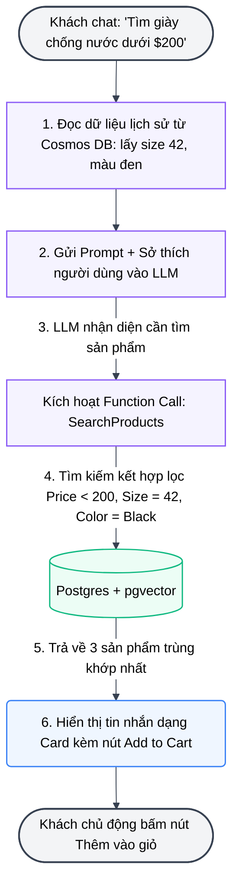

# Báo cáo Phân tích Ý tưởng Trợ lý Mua sắm AI (eShop AI Assistant)

Báo cáo này phân tích và so sánh hai ý tưởng triển khai Trợ lý Mua sắm AI cho hệ thống eShop từ góc độ Trải nghiệm người dùng (UX), Độ phức tạp kỹ thuật, và Giá trị nghiệp vụ.

---

## 1. Bảng So sánh & Đánh giá Chi tiết

| Tiêu chí | Ý tưởng 1: Tự động thêm vào giỏ hàng (Auto Add-to-Cart) | Ý tưởng 2: Gợi ý kèm nút "Thêm vào giỏ hàng" (Suggest with Add Button) |
| :--- | :--- | :--- |
| **Trải nghiệm người dùng (UX)** | 🔴 **Kém (Xâm phạm quyền chủ động):** Người dùng có cảm giác bị "áp đặt". Nếu họ chỉ đang hỏi để khảo giá nhưng AI tự thêm vào giỏ, họ sẽ mất công đi xóa. | 🟢 **Tuyệt vời (Quyền kiểm soát thuộc về User):** Đúng chuẩn trợ lý cá nhân. Đưa ra lựa chọn tốt nhất và để người dùng tự quyết định click mua. |
| **Xử lý tình huống nhiễu (Ambiguity)** | 🔴 **Kém:** Nếu có 3 mẫu giày đều chống nước < $200, AI sẽ phải tự đoán bừa 1 cái để thêm vào giỏ, dễ gây sai sót. | 🟢 **Rất tốt:** AI liệt kê cả 3 mẫu kèm lý do giới thiệu (màu sắc hợp gu, size vừa vặn) để người dùng tự so sánh và chọn. |
| **Độ phức tạp kỹ thuật** | 🟡 **Trung bình:** Yêu cầu LLM gọi function `AddToCart` trực tiếp sau khi phân tích ý định. | 🟢 **Thấp đến Trung bình:** LLM chỉ trả về danh sách sản phẩm gợi ý dưới dạng JSON, giao diện Blazor sẽ render các Card sản phẩm kèm nút bấm. |
| **Khả năng chuyển đổi đơn hàng (Conversion Rate)** | 🟡 **Trung bình:** Có thể gây khó chịu và khiến người dùng rời app nếu AI liên tục bỏ nhầm đồ vào giỏ. | 🟢 **Cao:** Người dùng được xem trước ảnh, thông số, và tự tin bấm nút mua. |

👉 **Kết luận:** **Ý tưởng 2 tối ưu hơn vượt trội về mặt UX.** Trong thiết kế phần mềm, nguyên tắc *"User Control and Freedom"* (Người dùng làm chủ) là tối thượng. AI chỉ nên đóng vai trò cố vấn, quyền hành động cuối cùng phải thuộc về khách hàng.

---

## 2. Kiến trúc Kỹ thuật để Phân tích Hành vi & Sở thích Người dùng

Để AI biết được kích cỡ giày (size) và màu sắc yêu thích của khách hàng, chúng ta triển khai luồng xử lý sau:

### A. Sơ đồ Luồng Hoạt động (Activity Flow)

### B. Cách AI học hành vi người dùng (User Profile Learning)
1. **Dữ liệu tĩnh (Tự khai báo):** Người dùng điền size giày và màu sắc yêu thích trong trang cá nhân ➔ Lưu vào hồ sơ khách hàng ở Cosmos DB.
2. **Dữ liệu động (Hành vi):** Khi khách hàng xem sản phẩm hoặc đặt hàng thành công, hệ thống gửi sự kiện lưu lại thông tin danh mục, màu sắc, thương hiệu vào Cosmos DB. 
3. **Phân tích của AI:** Trước khi gửi câu hỏi sang LLM, hệ thống tự động đính kèm thông tin: *"Khách hàng này thường đi giày size 42 và thích màu đen"* vào phần System Prompt ẩn của AI.

---

## 3. Khuyên dùng Mô hình AI (Recommended Models)

Để chạy local ổn định và đáp ứng được kỹ thuật **Function Calling (Gọi hàm/Công cụ ngầm)** để tìm kiếm sản phẩm:

### 1. Model Chat/LLM tốt nhất: **`qwen2.5:7b`** (hoặc **`llama3.1:8b`**)
* **Vì sao chọn `qwen2.5:7b`:** Đây là mô hình mã nguồn mở tốt nhất hiện nay về khả năng **Function Calling (Tool Use)** ở kích thước nhỏ. Nó hiểu tiếng Việt rất tốt, phân tích câu lệnh của người dùng ra các tham số cấu trúc (màu sắc, kích thước, giá tiền) cực kỳ chính xác để truyền xuống hàm SQL.
* **Cấu hình tối thiểu:** RAM 16GB. Nếu máy yếu hơn (chỉ dùng CPU hoặc RAM 8GB), hãy dùng **`phi3`** (Microsoft) bản 3.8B mặc dù khả năng gọi hàm sẽ kém nhạy hơn một chút.
* **Lệnh tải:** `ollama pull qwen2.5:7b`

### 2. Model Embedding: **`all-minilm`**
* **Vì sao:** Trả về vector 384 chiều, khớp hoàn hảo 100% với cột `vector(384)` trong cơ sở dữ liệu `catalogdb` của dự án eShop. Tốc độ sinh vector cực nhanh.
* **Lệnh tải:** `ollama pull all-minilm`
