# Technical Proposal: AI Chatbot Shopping Assistant Integration
**Client:** ABC  
**Prepared by:** Rikkeisoft Corporation  
**Date:** June 16, 2026  
**Document Version:** 1.0  
**Target Codebase:** eShop (.NET Core, Blazor, .NET Aspire, Catalog.API, Basket.API, Ordering.API)

---

## Slide 1: Technical Proposal
* **Document Title:** Technical Proposal for eShop AI Chatbot Shopping Assistant Integration
* **Primary Scope:** AI Assistant, Semantic Search, Product Discovery, Shopping Cart Integration, and Cloud LLM Orchestration.
* **Prepared for:** ABC Property Experience Platform & E-Commerce Expansion
* **Date:** June 16, 2026

---

## Slide 2: Table of Contents
* **Section 1: Strategic Alignment & Roadmap** (Slides 1–5)
* **Section 2: Architecture & Delivery** (Slides 6–10)
* **Section 3: Operations & Capabilities** (Slides 11–16)
* **Section 4: Project Governance & Roles** (Slides 17–21)
* **Section 5: Risk & Change Management** (Slides 22–26)

---

## Slide 3: Executive Summary
* **Current Context:** ABC operates a mature property experience platform serving 30+ clients, 191 buildings, and nearly 50,000 registered users in Australia. The platform offers 50+ features (member management, access control, bookings, integrations).
* **The Core Challenge:** ABC’s product team has designed 40+ new feature concepts in Figma, but the current engineering team of four developers is constrained by balancing routine maintenance with new feature delivery.
* **The Proposed Solution:** Integrate an AI-powered Chatbot Shopping Assistant directly into the eShop WebApp. The chatbot acts as an automated sales agent that helps users discover products semantically and add them to their shopping cart directly in the chat panel.
* **Phased Roadmap:**
  * **Phase 1 (10 Weeks):** Chatbot MVP. Includes a Blazor-based UI, semantic product search via `Catalog.API`, an inline Add-to-Cart button, and local memory fallback for sessions.
  * **Phase 2 (10–12 Weeks):** Smart Cards (Identity + Mobile integration), Newsfeed Polls, and Portfolio-level chatbot analytics.
  * **Phase 3 (8–10 Weeks):** Global Analytics, Advanced Payment/Rewards Cards, LLM-powered data summarizers.

---

## Slide 4: Understanding ABC’s Current Position
* **Engineering Bandwidth Gap:** 40+ Figma designs are waiting in the backlog. The 4-developer team spends excessive time on manual tasks, bug fixes, and maintenance.
* **Documentation & Testing Gaps:** No updated API specifications, DB schemas, or automated tests are available. This introduces regression risk during releases.
* **Chatbot Limitations (Prior to Optimization):**
  * **UI Latency:** Chat state-saving operations blocked the UI thread, freezing the interface for 10-15 seconds after each message.
  * **Interactivity Gaps:** Chat responses returned plain text without clickable links or images.
  * **State Synchronization:** Adding items to the cart from the chatbot did not update the header badge dynamically; users had to manually press F5.

---

## Slide 5: Proposed Solution Roadmap
We organize the chatbot integration into three distinct phases to ensure continuous delivery of value without breaking existing operations:

| Phase | Duration | Scope & Key Deliverables | Tech Stack Alignment |
| :--- | :--- | :--- | :--- |
| **Phase 1 (MVP)** | 10 Weeks | - Chatbot Web UI (`Chatbot.razor`) in Blazor.<br/>- Semantic Search using PostgreSQL `pgvector` & local Ollama (`all-minilm`).<br/>- Function calling for `AddToCart`.<br/>- In-memory backup fallback to bypass Cosmos DB local setup. | .NET Core, Blazor, .NET Aspire, EF Core, Ollama, PostgreSQL, Groq API (`llama-3.3-70b`) |
| **Phase 2 (Engagement)** | 10–12 Weeks | - Multilingual translation (EN/VN).<br/>- Smart card integration for mobile wallets.<br/>- Newsfeed polls widget and voting event handler. | .NET Core, Blazor WebApp, RabbitMQ Events, Redis Caching |
| **Phase 3 (Intelligence)** | 8–10 Weeks | - AI-powered data summaries & anomaly flags.<br/>- Generative UI rendering charts dynamically based on data shape.<br/>- Natural language analytics queries. | Semantic Kernel, Azure OpenAI / Groq, materialized database views |

---

## Slide 6: Phase 1 (MVP) Delivery Plan
The 10-week MVP timeline is split into four distinct stages:

```mermaid
gantt
    title Phase 1 (MVP) 10-Week Timeline
    dateFormat  X
    axisFormat Wk %d
    
    section Stage 1: Discovery
    Codebase Discovery & API Mapping :active, 0, 2
    section Stage 2: Core API
    REST API & gRPC Endpoints Build  : 2, 6
    section Stage 3: Chatbot Dev
    Blazor Chatbot UI & Parser Dev   : 6, 9
    section Stage 4: Testing & Release
    QA Testing, Documentation & UAT  : 9, 10
```



* **Weeks 1–2 (Codebase Discovery):** Review existing data models in `Catalog.API`, map database tables, set up local development Docker containers, and define API contracts.
* **Weeks 3–6 (API & Frontend Build):** Implement the REST/gRPC backend endpoints, set up the HttpClient pipeline with custom headers, and establish model fallback configurations.
* **Weeks 7–9 (Chatbot Dev):** Build the Blazor chat interface, integrate markdown parsing (handling images, links, and Add to Cart buttons), and wire the `BasketUpdateNotifier` for real-time badge updates.
* **Week 10 (Testing & Handover):** Write xUnit tests, execute integration tests, perform manual UAT, and hand over technical documentation.

---

## Slide 7: Proposed Solution Approach
* **Core Principle:** Leverage ABC's existing data infrastructure without requiring an expensive database rewrite or event pipeline rebuild.
* **Service Independence:** The chatbot runs as an isolated component inside the `WebApp` and `Catalog.API`, connecting to existing services via gRPC.
* **Graceful Degradation:** If external LLM APIs fail, the chatbot displays friendly messages. If Cosmos DB is unavailable, local memory storage fallback handles session histories.

---

## Slide 8: Proposed High-Level Solution Architecture
The diagram below shows how the AI Chatbot integrates with the existing microservices and external LLM provider:

```mermaid
graph TB
    subgraph WebAppCircuit ["WebApp Server Circuit"]
        ChatbotRazor["Chatbot.razor (Blazor UI)"]
        ChatState["ChatState.cs (Chat State Manager)"]
        MessageProcessor["MessageProcessor.cs (Markdown Parser)"]
        BasketState["BasketState.cs"]
        BasketUpdateNotifier["BasketUpdateNotifier.cs (Event Bus)"]
        CartMenu["CartMenu.razor (Header Badge)"]
    end

    subgraph CatalogService ["Catalog.API Microservice"]
        CatalogController["CatalogController.cs"]
        ChatMemoryService["ChatMemoryService.cs"]
        Postgres[(PostgreSQL pgvector)]
    end

    subgraph ExternalServices ["External Services"]
        GroqAPI["Groq LPU API (llama-3.3-70b-versatile)"]
        Ollama["Ollama Container (all-minilm embedding)"]
    end

    ChatbotRazor -->|User Input| ChatState
    ChatState -->|Parse Markdown| MessageProcessor
    ChatState -->|Call LLM with Tools| GroqAPI
    ChatState -->|Tool Call: SearchCatalog| CatalogController
    CatalogController -->|Generate Vector| Ollama
    CatalogController -->|Semantic Match| Postgres
    ChatState -->|Tool Call: AddToCart| BasketState
    BasketState -->|gRPC Call| BasketAPI["Basket.API"]
    BasketState -->|Notify Cart Update| BasketUpdateNotifier
    BasketUpdateNotifier -->|Trigger Event| CartMenu
    ChatState -->|Save Session (Async)| ChatMemoryService
```

---

## Slide 9: Analytics & Chatbot Delivery Architecture
1. **Request Pipeline Integration:** Injected a `CustomHeaderPolicy` to automatically add a `thought_signature` header to outgoing LLM requests, resolving the HTTP 400 bad request error.
2. **Async History Saving:** Session data is persisted using `ChatMemoryService` asynchronously in a background thread, preventing blocking calls from freezing the frontend Blazor circuit.
3. **Local Dev Fallback:** Configured `useInMemoryFallback = true` in `ChatMemoryService` so developers can run the app locally using a `ConcurrentDictionary` cache instead of spinning up the memory-heavy Cosmos DB Emulator.

---

## Slide 10: Quality Assurance & Testing Strategy
Our testing strategy ensures stability across releases using a lean, three-tiered testing model:

* **Unit Tests (Business Logic):**
  * Target: `MessageProcessor.cs`
  * Coverage: Verifies that markdown text returned by Llama 3.3 is correctly parsed into HTML components (`MarkupString`) like image tags, product links, and `add-to-cart` buttons.
* **Integration Tests (API & gRPC):**
  * Target: `Catalog.API` & `Basket.API`
  * Coverage: Verifies function calling payloads, semantic search response accuracy, and cart modification gRPC channels.
* **Regression Tests (E2E WebApp):**
  * Target: Blazor frontend flows
  * Coverage: Automated Playwright tests run against the development server to ensure adding items from the chat panel does not break manual checkouts or item detail pages.

---

## Slide 11: Key Challenges & Mitigation Strategy MVP

> [!WARNING]
> ### 1. LLM Tool Calling Hallucinations & Infinite Loops
> * **Challenge:** Llama 3.3 sometimes outputted conversational text or thoughts during the same turn it called a tool. This caused `ClientResultException` or 400 Bad Requests on the gateway.
> * **Mitigation:** Applied strict system prompt instructions forcing the model to output a **completely empty text response** (null or empty string) whenever it invokes a tool. The model is only permitted to write conversational text after the tool execution has finished and returned results.

> [!NOTE]
> ### 2. Resource Constraints during Local Development
> * **Challenge:** Cosmos DB Emulator requires 3-4 GB of RAM, which overloads local developer machines with 8GB RAM.
> * **Mitigation:** Built an in-memory session backup (`ConcurrentDictionary` cache) enabled by default in local settings. Developers can stop the Cosmos DB container entirely, freeing up local memory.

> [!CAUTION]
> ### 3. LLM API Rate Limits (429 Too Many Requests)
> * **Challenge:** Free tiers of LLM providers limit RPM (Requests Per Minute) and TPM (Tokens Per Minute), which can freeze the chatbot when multiple users send queries.
> * **Mitigation:** Implemented a retry-after handler in the `HttpClient` pipeline and structured system prompts to minimize token consumption per turn.

---

## Slide 12: MVP Delivery Team & Commercials
We suggest a highly efficient team structure optimized for the .NET Aspire environment:

* **Roles:** 1 Project Manager/BA, 1 Backend .NET Developer, 1 Frontend Blazor Developer, and 1 QA Automation Engineer (Part-time).
* **Delivery Model:** Agile sprints (2 weeks per sprint), culminating in a working release at Sprint 5 (Week 10).
* **Scope Guarantee:** Delivery is limited to the Chatbot service MVP and its integration with the core eShop database.

---

## Slide 13: Roles and Responsibilities
* **RKTech (Development Partner):**
  * Tech Lead / Solution Architect: Event schemas, security policies, and gRPC endpoints design.
  * Backend Developer: Postgres pgvector integration, gRPC catalog APIs, and background memory services.
  * Frontend Developer: Blazor Chatbot components (`Chatbot.razor`), custom CSS layout, and event listener hooks.
  * QA Engineer: xUnit test suite, Playwright regression scripting.
* **ABC (Client):**
  * Provide codebase access, API documentation, and staging database connection strings (Weeks 1-2).
  * Clarify business logic queries and product specifications within 1 business day.
  * Participate in sprint review meetings and sign off on UAT deliverables promptly.

---

## Slide 14: AI Advanced Features Suggestion
To further enhance the shopping experience, we propose several value-add features for Phase 2:
1. **Smart Product Matching:** The chatbot matches broad descriptions (e.g., "warm jackets for rain") with specific catalog categories like hiking or skiing gear.
2. **Cart Abandonment Prevention:** If a user adds an item via the chatbot but does not check out within 10 minutes, the chatbot can display a friendly checkout reminder.
3. **Interactive Newsfeed Polls:** Inline widgets that allow users to vote on product styles (e.g., "Which hiking boots color do you prefer?"), sending events directly to the database.

---

## Slide 15: Proposed Dashboard & Chatbot Capabilities
We deliver three dashboard layers to provide business insights:

* **Project-Level Dashboard:**
  * Displays active chat sessions, successful cart additions via AI, average response latency, and frequently asked product queries.
* **Portfolio-Level Dashboard:**
  * Compares chatbot usage, user satisfaction, and purchase conversion rates across multiple eShop projects.
* **Global Analytics:**
  * Platform-wide internally managed dashboard for ABC administrators, tracking catalog item popularity, user growth trends, and feature adoption metrics.

---

## Slide 16: Proposed AI Scope & Approach
Our AI data flow focuses on secure, tenant-scoped data retrieval:

```
[User Query] ──> [Blazor ChatState] ──> [LLM (Intents & Tool Calls)]
                                                  │
                                                  ▼ (Tool Call: SearchCatalog)
[Postgres Database] <── [Ollama Vector Match] <── [Catalog.API Controller]
       │
       ▼ (Results)
[LLM Formats Output] ──> [Blazor MessageProcessor] ──> [Rendered Rich UI HTML]
```

1. **Materialized Views:** Pre-aggregated hourly/daily views on PostgreSQL ensure rapid read speeds for the analytics dashboard widgets.
2. **Tenant Scoping:** All queries are filtered using tenant JWT identifiers, ensuring project managers only see data for their assigned projects.
3. **Generative UI:** The AI dynamically outputs structured product links (`[Name](/item/Id)`) and cart buttons (`[Add to Cart](submit:add-to-cart:Id)`) that Blazor parses into interactive controls.

---

## Slide 17: Value-Add Proposal: AI-Generated Documentation
* **The Challenge:** The current eShop codebase has no unified entity-relationship diagrams (ERDs), API specifications, or sequence flow diagrams. This slows down onboarding for new developers.
* **Our Value-Add Solution:** During the discovery sprint, Rikkeisoft will run an automated AI static analysis framework over the codebase.
* **Guarantee:** This documentation is generated in a fully isolated local environment. ABC's proprietary code never touches public training pipelines.

---

## Slide 18: Turning Legacy Code into Secure Digital Assets with AI
We deliver the following documentation artifacts for the eShop codebase:

* **API Specs (Swagger/OpenAPI):** Interactive documentation allowing developers to test endpoints.
* **Sequence Diagrams (Mermaid.js):** Flow maps covering gRPC calls, cross-circuit Blazor event bus channels, and ordering logic.
* **Database Schema maps:** Visualization of catalog tables, brands, types, and pgvector properties.
* **Onboarding Wiki:** Step-by-step developer setup and system map.
* **Cost:** Offered as a **FREE** Value-Add when ABC commits to the Phase 1 Pilot partnership.

---

## Slide 19: Appendix
* Technical references, API contract samples, and standard JSON function calling payloads.

---

## Slide 20: Role & Responsibilities: Leadership Team
* **Account Manager (Rikkeisoft):** Handles commercial agreements, scope changes, and billing. Serves as the Level 3 escalation contact.
* **Delivery Manager (Rikkeisoft):** Manages weekly sprint planning, velocity tracking, bi-weekly demos, and scope change requests.
* **Phase 2 & 3 Expansion:** Outlines roles for data specialists and full-time QA engineers as the feature set grows.

---

## Slide 21: Role & Responsibilities: Development Team

### Tech Lead / Solution Architect (.NET)
* Designs event hooks, gRPC schemas, and JWT tenant validation filters.
* Reviews all Pull Requests and maintains codebase standards.
* Audits catalog integration points for AI search.

### Backend Developer (.NET Core)
* Builds REST and gRPC endpoints in `Catalog.API` and `Basket.API`.
* Integrates PostgreSQL pgvector and the Ollama embedding service.
* Configures the async history-saving pipeline and memory fallback.

### Frontend Developer (Blazor/Razor)
* Implements `Chatbot.razor` UI, CSS layout, and input bubble event handling.
* Coordinates CancellationToken implementations for stop-generation requests.
* Listens to the `BasketUpdateNotifier` to update cart badges.

---

## Slide 22: Communication Plan
* **Daily Standups:** Internally managed by Rikkeisoft. Status reports are posted on Slack daily.
* **Bi-Weekly Review:** Teams demo working features via MS Teams or Google Meet at the end of each sprint.
* **Escalation Path:** Level 1 (Tech Lead - 1 day) ──> Level 2 (Delivery Manager - 2 days) ──> Level 3 (Account Manager - 1 week).

---

## Slide 23: Project Management Tool
* **Tools:** Jira for backlog management and sprint tracking, Azure DevOps for pipelines, and Figma for UI mockups.
* **Licenses:** Client provides guest developer licenses to their Azure DevOps environment.

---

## Slide 24: Change Management Plan
* **Process:** Any change requests are evaluated by the Delivery Manager and Tech Lead within 2 business days.
* **Sprint Backlog:** Approved changes are estimated and added to the backlog. Middle-of-sprint modifications are avoided to protect team velocity.
* **Documentation:** Architecture Decision Records (ADRs) are updated immediately upon scope adjustments.

---

## Slide 25: Risk Management Plan
We identify and mitigate 7 key risks for the Chatbot project:

1. **API Latency Spikes:** Mitigated by pre-fetching and caching embeddings.
2. **LLM Rate Limiting:** Mitigated by a retry handler and compact prompts.
3. **Database Schema Drift:** Mitigated by automated EF Core migrations.
4. **Prompt Injection:** Mitigated by input sanitization and strict system prompt system controls.
5. **Session Data Leakage:** Mitigated by Row-Level Security (RLS) in databases.
6. **Local Machine Hardware Limits:** Mitigated by the local in-memory history fallback.
7. **User Adoption Barriers:** Mitigated by clean, interactive HTML UI rather than block text.

---

## Slide 26: Rikkeisoft Corporation
* **Vietnam Offices:** Hanoi, Da Nang, Ho Chi Minh City, Hue.
* **US Subsidiary:** RKTECH CORP (Plano, Texas).
* **Japan Branch:** RIKKEI JAPAN (Tokyo, Osaka, Nagoya, Fukuoka).
* **Thailand Branch:** RIKKEI THAILAND (Bangkok).
* **Website:** www.rikkeisoft.com  
* **Point of Contact:** truonglpx@rikkeisoft.com
