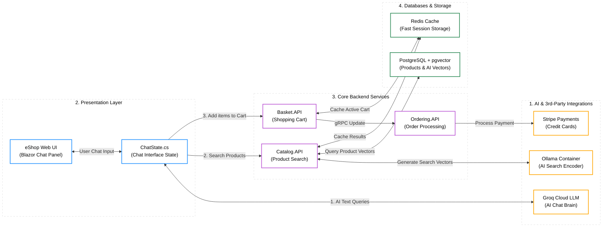

# Slide 4: Low-Level System Architecture Diagram (eShop AI Chatbot)

Below is the Mermaid code representing the updated 4-column system architecture for the eShop AI Chatbot, matching the layout and color coding of Slide 4 (Image 1) but using the new tech stack (.NET Core, Blazor, pgvector, Ollama, Groq, Stripe).

---

## Instructions to import into Draw.io:
1. Open [Draw.io](https://app.diagrams.net/).
2. Select **Arrange** -> **Insert** -> **Advanced** -> **Mermaid**.
3. Copy the Mermaid block above and paste it into the textbox.
4. Click **Insert** to generate editable boxes, styling, and structure that matches the template perfectly!
