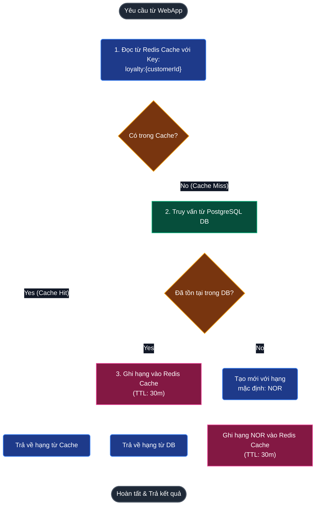
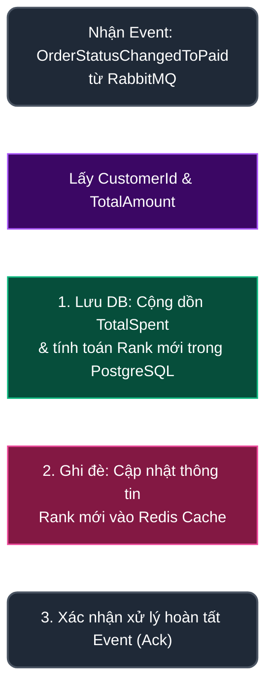

# Báo cáo so sánh nâng cấp dịch vụ Discount.API: Phiên bản V1 và Phiên bản V2

Tài liệu này chi tiết sự cải tiến vượt bậc về mặt kiến trúc, hiệu năng và tính năng nghiệp vụ của dịch vụ tích lũy điểm & nâng hạng thành viên (`Discount.API`) giữa hai phiên bản V1 (In-Memory) và V2 (PostgreSQL + Redis Cache).

---

## 1. Bảng so sánh tổng quan giữa V1 và V2

| Đặc tính | Phiên bản V1 (In-Memory) | Phiên bản V2 (PostgreSQL & Redis Cache) | Đánh giá mức độ cải tiến |
| :--- | :--- | :--- | :--- |
| **Nơi lưu trữ gốc (Source of Truth)** | Bộ nhớ RAM (Static Dictionary `LoyaltyDb`) | Cơ sở dữ liệu **PostgreSQL** (`discountdb`) | **Cực kỳ an toàn**: Không mất dữ liệu khi restart dịch vụ. |
| **Cơ chế đọc dữ liệu (Read Path)** | Đọc trực tiếp từ bộ nhớ tiến trình | Truy vấn từ **Redis Cache** (tốc độ đọc dưới **1ms**), fallback về PostgreSQL nếu cache miss | **Hiệu năng cao**: Tối ưu hóa tải, đáp ứng hàng triệu truy vấn đồng thời từ WebApp. |
| **Cơ chế ghi dữ liệu (Write Path)** | Ghi trực tiếp vào bộ nhớ tiến trình khi nhận sự kiện RabbitMQ | Ghi đồng thời xuống **PostgreSQL** (đảm bảo ACID) và ghi đè cập nhật vào **Redis Cache** | **Độ tin cậy tuyệt đối**: Dữ liệu thanh toán được ghi nhận an toàn, cache luôn được đồng bộ. |
| **Khả năng mở rộng (Scaling)** | **Không thể**: Nhân bản API sẽ làm phân mảnh bộ nhớ RAM. | **Rất tốt**: Các instance API chạy độc lập (Stateless) vì dữ liệu được lưu trữ tập trung. | **Sẵn sàng cho Production**: Phù hợp triển khai Kubernetes / Docker Swarm. |
| **Hiển thị giao diện (UI/UX)** | Chỉ hiển thị tên tài khoản thuần túy ở header bar. | Hiển thị nhãn hạng thành viên dạng badge màu gradient nổi bật cạnh tên ở header. | **Trực quan & Chuyên nghiệp**: Tăng trải nghiệm người dùng, kích thích mua sắm tích điểm. |

---

## 2. Chi tiết kiến trúc dòng chảy dữ liệu của Phiên bản V2

Phiên bản V2 triển khai mẫu thiết kế **Cache-Aside** (Đọc từ Cache) và **Write-Through** (Ghi đồng thời DB và Cache). Luồng xử lý được thể hiện trực quan qua hai biểu đồ khối tuần tự dưới đây:

### A. Luồng Đọc (Read Flow) - Cache-Aside
Được kích hoạt khi WebApp hiển thị Badge Rank hoặc khi thực hiện áp dụng giảm giá trong giỏ hàng:



### B. Luồng Ghi (Write Flow) - Write-Through & Event Driven
Được kích hoạt bất đồng bộ khi đơn hàng chuyển sang trạng thái thanh toán thành công:



---

## 3. Các thay đổi cụ thể trong mã nguồn

### A. Cấu hình eShop.AppHost
Trong V2, chúng ta đã đăng ký tài nguyên cơ sở dữ liệu `discountdb`, đồng thời liên kết hệ thống hàng đợi **RabbitMQ** và **Redis Cache** vào `discount-api`:
```csharp
// 1. Đăng ký container RabbitMQ làm Event Bus chung của hệ thống
var rabbitMq = builder.AddRabbitMQ("eventbus").WithLifetime(ContainerLifetime.Persistent);

// 2. Đăng ký db riêng biệt cho discount
var discountDb = postgres.AddDatabase("discountdb");

// 3. Tham chiếu db, cache, và rabbitMq vào discount-api
var discountApi = builder
    .AddProject<Projects.Discount_API>("discount-api")
    .WithReference(discountDb) 
    .WithReference(redis) 
    .WithReference(rabbitMq) // <--- Khai báo để API kết nối được với RabbitMQ
    .WaitFor(rabbitMq);      // Đợi RabbitMQ khởi động xong mới chạy API
```

### B. Cấu hình kết nối và lắng nghe Event trong Discount.API
* **Tham chiếu Dự án chung:** Trong [Discount.API.csproj](file:///d:/Subagent/Nhom_10_DevOps_Testing_Production/eShop-main/src/Discount.API/Discount.API.csproj), dự án tham chiếu tới thư viện chung `EventBusRabbitMQ` để sử dụng dịch vụ EventBus của hệ thống.
* **Đăng ký kết nối và Subscribe trong [Program.cs](file:///d:/Subagent/Nhom_10_DevOps_Testing_Production/eShop-main/src/Discount.API/Program.cs):**
  ```csharp
  // Đăng ký EventBus kết nối với RabbitMQ và đăng ký nhận sự kiện (Subscription)
  builder
      .AddRabbitMqEventBus("EventBus")
      .AddSubscription<
          OrderStatusChangedToPaidIntegrationEvent,
          OrderStatusChangedToPaidIntegrationEventHandler
      >();
  ```
  *(API sẽ tự động lắng nghe Queue được tạo trên RabbitMQ, khi có Event `OrderStatusChangedToPaid` được bắn ra từ Ordering service, handler sẽ tự động được gọi).*

### C. Thay thế bộ lưu trữ tạm thời bằng EF Core và Redis Client
- **Model thực thể**: Tạo mới [CustomerLoyalty.cs](file:///d:/Subagent/Nhom_10_DevOps_Testing_Production/eShop-main/src/Discount.API/CustomerLoyalty.cs) để biểu diễn cấu trúc bảng dữ liệu trong PostgreSQL.
- **Lớp Database Context**: Tạo [LoyaltyDbContext.cs](file:///d:/Subagent/Nhom_10_DevOps_Testing_Production/eShop-main/src/Discount.API/LoyaltyDbContext.cs) kế thừa `DbContext` để quản lý truy vấn SQL.
- **Xóa bộ lưu trữ In-memory cũ**: Loại bỏ hoàn toàn file `LoyaltyDb.cs` chứa dictionary tĩnh nhằm giải phóng RAM và chuyển sang chiết khấu không trạng thái (stateless).
- **Tự động tạo bảng khi khởi động**:
  ```csharp
  using (var scope = app.Services.CreateScope())
  {
      var context = scope.ServiceProvider.GetRequiredService<LoyaltyDbContext>();
      await context.Database.EnsureCreatedAsync(); // Tự tạo DB và bảng nếu chưa có
  }
  ```

### C. Nâng cấp xử lý sự kiện trong Event Handler
Trong [OrderStatusChangedToPaidIntegrationEventHandlers.cs](file:///d:/Subagent/Nhom_10_DevOps_Testing_Production/eShop-main/src/Discount.API/IntegrationEvents/EventHandling/OrderStatusChangedToPaidIntegrationEventHandlers.cs), khi nhận được sự kiện thanh toán:
1. Tìm kiếm thông tin khách hàng trong PostgreSQL, cộng dồn số tiền thanh toán vào `TotalSpent`.
2. Tính toán hạng thành viên mới:
   - `>= 100$`: **Platium**
   - `>= 300$`: **Dimond**
   - `>= 500$`: **VIP**
   - `>= 1000$`: **SVIP**
3. Lưu dữ liệu xuống Postgres bằng `await dbContext.SaveChangesAsync()`.
4. Gọi `redisDb.StringSetAsync(cacheKey, loyalty.Rank)` để đảm bảo thông tin trên Redis Cache cập nhật ngay lập tức.

### D. Hiển thị nhãn trên WebApp (UI Badge)
- Sửa [UserMenu.razor](file:///d:/Subagent/Nhom_10_DevOps_Testing_Production/eShop-main/src/WebApp/Components/Layout/UserMenu.razor) để tự động gọi API giảm giá lấy hạng thành viên khi người dùng đăng nhập.
- Hiển thị nhãn rank cạnh tên người dùng:
  ```razor
  <h3>
      <span class="rank-badge @(_rank.ToLower())">@_rank</span>
      @context.User.Identity?.Name
  </h3>
  ```
- Thêm CSS cho từng hạng trong [UserMenu.razor.css](file:///d:/Subagent/Nhom_10_DevOps_Testing_Production/eShop-main/src/WebApp/Components/Layout/UserMenu.razor.css) với màu sắc gradient hiện đại và hiệu ứng động:
  - **SVIP**: Nền gradient Cam-Vàng rực rỡ kèm hiệu ứng động nhấp nháy phát sáng (Pulse animation) cực kỳ cao cấp.
  - **VIP**: Nền Tím mộng mơ quý phái.
  - **Diamond**: Xanh ngọc lam óng ánh.
  - **Platinum**: Bạc ánh kim loại sang trọng.
  - **NOR**: Xám nhạt thanh lịch.

---

## 4. Tóm tắt giá trị nghiệp vụ của phiên bản V2

*   **Không sợ Server crash**: Dữ liệu khách hàng được bảo vệ 100% trong ổ đĩa cứng của PostgreSQL.
*   **Trải nghiệm mượt mà**: Nhờ có Redis, thao tác chuyển trang và xem giỏ hàng của khách hàng không bị chậm trễ do nghẽn kết nối Database.
*   **Thúc đẩy bán hàng**: Nhãn hạng thành viên phát sáng SVIP hiển thị trực quan ở vị trí dễ nhìn thấy nhất kích thích tinh thần sở hữu và tích điểm của người dùng.
