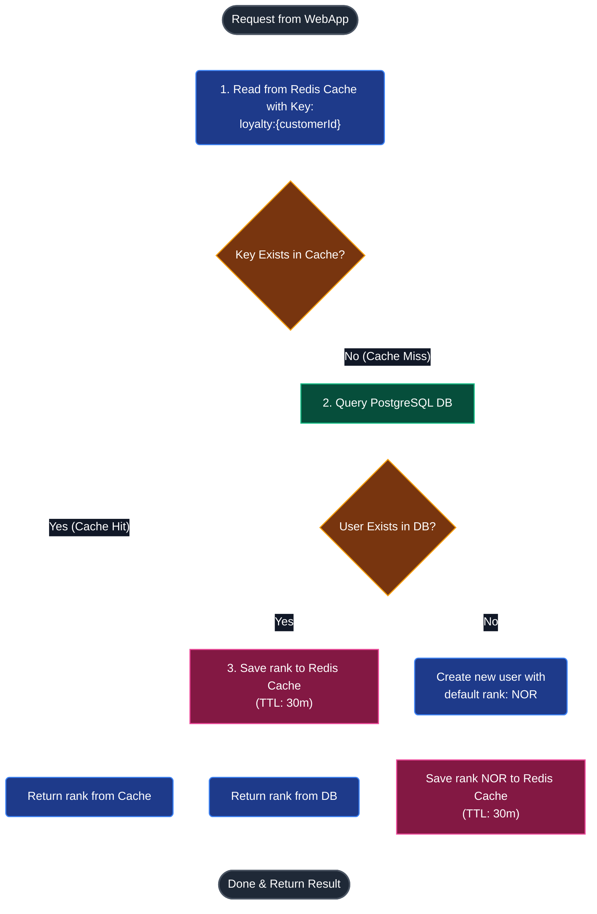
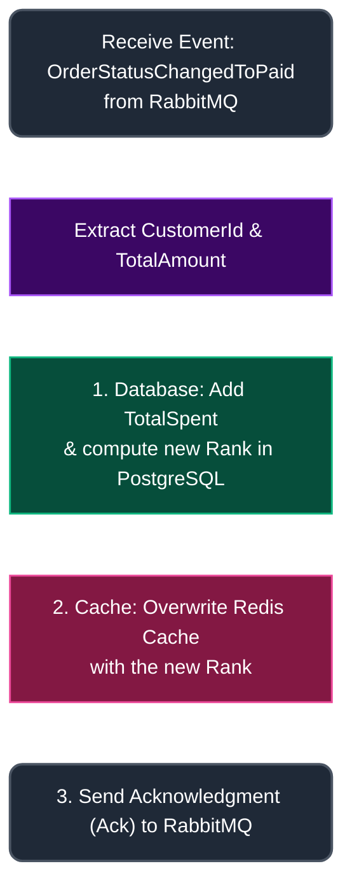

# Comparison & Integration Report for Discount.API: Version 1 vs. Version 2

This document details the architectural, performance, and business improvements made to the member loyalty and rank system (`Discount.API`) between Version 1 (In-Memory) and Version 2 (PostgreSQL + Redis Cache + RabbitMQ).

---

## 1. High-Level Comparison Table (V1 vs. V2)

| Feature | Version 1 (In-Memory) | Version 2 (PostgreSQL & Redis Cache) | Architectural Value |
| :--- | :--- | :--- | :--- |
| **Source of Truth** | System memory (Static Dictionary `LoyaltyDb`) | Persistent Database: **PostgreSQL** (`discountdb`) | **High Durability**: Zero data loss upon service restarts. |
| **Read Path** | Directly read from local RAM | Queries **Redis Cache** (sub-**1ms** response time), falls back to PostgreSQL on cache miss | **High Performance**: Optimizes server load, handling millions of requests concurrently. |
| **Write Path** | Directly written to RAM | Persisted in **PostgreSQL** (ACID compliance) and synchronized with **Redis Cache** | **High Reliability**: Securely records transactional spending and keeps cache up-to-date. |
| **Scaling Capability** | **None**: Horizontal scaling breaks memory state consistency. | **Excellent**: Stateless API instances running independently with a shared backend | **Production Ready**: Ideal for Kubernetes / Docker Swarm deployments. |
| **UI/UX Badges** | Text-only username display on the header bar. | Glowing, animated gradient rank badges beside the username on the header. | **High Engagement**: Enhances user experience and drives repetitive sales through gamification. |

---

## 2. Version 2 Data Flow Architecture

Version 2 implements a combination of the **Cache-Aside** (for reading) and **Write-Through** (for writing) patterns. The flows are detailed in the sequence diagrams below:

### A. Read Flow (Cache-Aside)
Triggered when the WebApp requests the user's rank badge or applies loyalty discounts during checkout:



### B. Write Flow (Write-Through & Event-Driven)
Triggered asynchronously after a customer's order is successfully paid:



---

## 3. Specific Code Changes

### A. Configuration in eShop.AppHost
In V2, we registered the PostgreSQL database `discountdb`, as well as the **RabbitMQ** event bus and **Redis** cache, linking them to the `discount-api` resource:
```csharp
// 1. Register persistent RabbitMQ container as System Event Bus
var rabbitMq = builder.AddRabbitMQ("eventbus").WithLifetime(ContainerLifetime.Persistent);

// 2. Register PostgreSQL database resource for Discount API
var discountDb = postgres.AddDatabase("discountdb");

// 3. Link DB, Cache, and RabbitMQ to the discount-api project
var discountApi = builder
    .AddProject<Projects.Discount_API>("discount-api")
    .WithReference(discountDb) 
    .WithReference(redis) 
    .WithReference(rabbitMq) // Enables connection to RabbitMQ
    .WaitFor(rabbitMq);      // Ensures API waits for RabbitMQ to start
```

### B. Connection Setup & Event Subscription in Discount.API
* **Project Reference:** [Discount.API.csproj](file:///d:/Subagent/Nhom_10_DevOps_Testing_Production/eShop-main/src/Discount.API/Discount.API.csproj) references the shared project `EventBusRabbitMQ` to utilize the standard messaging client.
* **Service Registration in [Program.cs](file:///d:/Subagent/Nhom_10_DevOps_Testing_Production/eShop-main/src/Discount.API/Program.cs):**
  ```csharp
  // Register RabbitMQ EventBus client and subscribe to paid order events
  builder
      .AddRabbitMqEventBus("EventBus")
      .AddSubscription<
          OrderStatusChangedToPaidIntegrationEvent,
          OrderStatusChangedToPaidIntegrationEventHandler
      >();
  ```

### C. Replacing In-Memory Storage with EF Core and Redis
* **Entity Model:** Added [CustomerLoyalty.cs](file:///d:/Subagent/Nhom_10_DevOps_Testing_Production/eShop-main/src/Discount.API/CustomerLoyalty.cs) to map the Postgres table schema.
* **DB Context:** Created [LoyaltyDbContext.cs](file:///d:/Subagent/Nhom_10_DevOps_Testing_Production/eShop-main/src/Discount.API/LoyaltyDbContext.cs) extending `DbContext` to handle database queries.
* **Code Clean-up:** Deleted the static dictionary `LoyaltyDb.cs` to free system RAM and establish stateless API operations.
* **Auto Migration at Startup:**
  ```csharp
  using (var scope = app.Services.CreateScope())
  {
      var context = scope.ServiceProvider.GetRequiredService<LoyaltyDbContext>();
      await context.Database.EnsureCreatedAsync(); // Automatically creates database & tables if missing
  }
  ```

### D. Upgraded Logic in Event Handler
In [OrderStatusChangedToPaidIntegrationEventHandlers.cs](file:///d:/Subagent/Nhom_10_DevOps_Testing_Production/eShop-main/src/Discount.API/IntegrationEvents/EventHandling/OrderStatusChangedToPaidIntegrationEventHandlers.cs), upon receiving the paid order event:
1. The database is queried for the customer's record, and the order's total value is added to `TotalSpent`.
2. The user's membership tier is recalculated based on the following brackets:
   - `>= $100`: **Platinum**
   - `>= $300`: **Diamond**
   - `>= $500`: **VIP**
   - `>= $1000`: **SVIP**
3. Changes are written to PostgreSQL via `await dbContext.SaveChangesAsync()`.
4. Changes are updated in cache via `redisDb.StringSetAsync(cacheKey, loyalty.Rank)`.

### E. Frontend Badges on WebApp (UI Layout)
* Modified [UserMenu.razor](file:///d:/Subagent/Nhom_10_DevOps_Testing_Production/eShop-main/src/WebApp/Components/Layout/UserMenu.razor) to query the Discount service for the logged-in user's rank.
* Rendered the badge next to the user's name:
  ```razor
  <h3>
      <span class="rank-badge @(_rank.ToLower())">@_rank</span>
      @context.User.Identity?.Name
  </h3>
  ```
* Styled badges with dynamic, gradient colors in [UserMenu.razor.css](file:///d:/Subagent/Nhom_10_DevOps_Testing_Production/eShop-main/src/WebApp/Components/Layout/UserMenu.razor.css):
  - **SVIP**: Energetic Orange-Yellow gradient background with a custom pulsing animation.
  - **VIP**: Royal Purple.
  - **Diamond**: Turquoise.
  - **Platinum**: Metallic Silver.
  - **NOR**: Light Grey.

---

## 4. Business Value of Version 2

*   **Reliability**: Customer loyalty data is protected against service restarts and server crashes.
*   **Performance**: Redis Cache handles user queries under 1ms, preventing database overhead during high-traffic checkout events.
*   **Customer Retention**: Glowing member ranks gamify the shopping experience, driving repetitive sales and brand loyalty.
