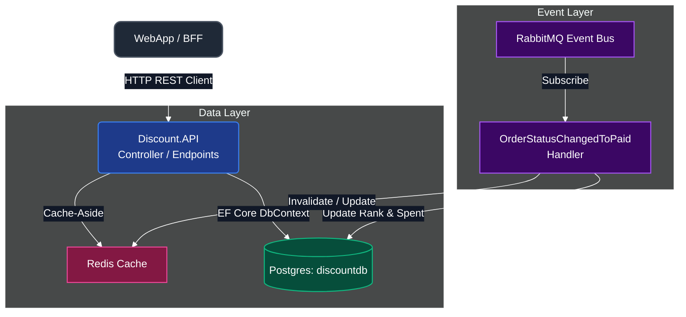
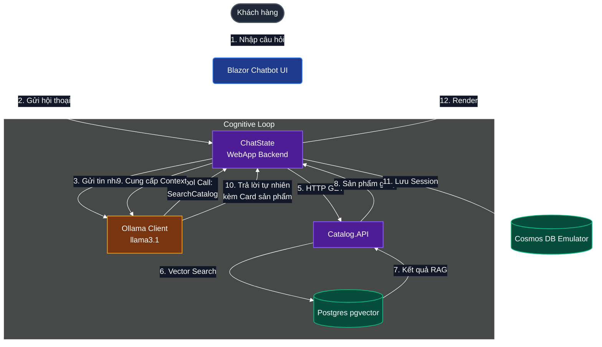

# Báo cáo Kiến trúc: Phân tích Microservices (Discount.API) và Hệ thống Trợ lý AI (eShop AI)

Báo cáo này phân tích chi tiết cấu trúc thiết kế, các mẫu thiết kế (Design Patterns) biến `Discount.API` thành một microservice chuẩn mực, và làm rõ bản chất vận hành của hệ thống Trợ lý ảo AI tích hợp trong eShop.

---

## 1. Bản chất kiến trúc của `Discount.API` (Microservice)

`Discount.API` là một dịch vụ thành viên độc lập trong hệ thống eShop. Nó được coi là một **microservice thực thụ** vì tuân thủ nghiêm ngặt các nguyên tắc thiết kế hệ thống phân tán và áp dụng các mẫu thiết kế kinh điển dưới đây:

### A. Sơ đồ Kiến trúc `Discount.API`

### B. Các Design Patterns áp dụng trong `Discount.API`

| Tên Design Pattern | Cách áp dụng trong `Discount.API` | Ý nghĩa / Lợi ích |
| :--- | :--- | :--- |
| **Database-per-Microservice** | Dịch vụ sở hữu cơ sở dữ liệu riêng biệt (`discountdb` trên PostgreSQL). Không có service nào khác được truy cập trực tiếp vào DB này. | Đảm bảo tính độc lập dữ liệu (Loose Coupling). Một DB lỗi không làm sập toàn bộ hệ thống. |
| **Cache-Aside (Redis + DB)** | Khi đọc thông tin Loyalty, hệ thống đọc từ Redis Cache trước. Nếu không có (Cache Miss), nó truy vấn Postgres, lưu lại vào Redis rồi trả về. | Tối ưu hóa hiệu năng đọc (Read Path) cực cao dưới **1ms**, giảm tải cho database chính. |
| **Event-Driven Architecture (Pub/Sub)** | Đăng ký nhận sự kiện `OrderStatusChangedToPaidIntegrationEvent` từ RabbitMQ khi đơn hàng thanh toán thành công để tự động cộng điểm tích lũy. | Giao tiếp bất đồng bộ, không gây nghẽn tiến trình đặt hàng chính (Eventual Consistency). |
| **Dependency Injection (DI)** | Đăng ký và quản lý vòng đời của `DbContext`, `RedisClient`, và các Event Handlers thông qua Service Container của ASP.NET Core. | Dễ dàng viết Unit Test (Mocking), giảm mức độ phụ thuộc cứng giữa các lớp logic. |
| **Options Pattern** | Dùng cấu hình strongly-typed (lớp cấu hình C#) map trực tiếp với file `appsettings.json` để cấu hình đường dẫn Redis, Postgres. | Đảm bảo tính an toàn kiểu dữ liệu và tập trung hóa việc quản lý cấu hình. |

---

## 2. Bản chất kiến trúc của Trợ lý AI (eShop AI)

Hệ thống AI trong eShop **không phải là một microservice độc lập**, mà là một **Cognitive Capability (Khả năng nhận thức/Trí tuệ nhân tạo)** được tích hợp phân tán vào các service sẵn có nhằm tăng tính tương tác.

### A. Sơ đồ Luồng hoạt động của Trợ lý AI

### B. Các Design Patterns và Kỹ thuật AI áp dụng

1. **Retrieval-Augmented Generation (RAG)**
   * **Cách hoạt động:** Thay vì để LLM tự đoán sản phẩm (thường bị ảo tưởng/hallucination), hệ thống sẽ tìm kiếm các sản phẩm thực tế có độ tương đồng cao trong database thông qua Vector Search (dùng model `all-minilm` tạo embedding và `pgvector` tính toán khoảng cách cosine). Sau đó, đưa thông tin sản phẩm này vào Prompt làm ngữ cảnh (Context) để LLM trả lời.
   * **Lợi ích:** Đảm bảo câu trả lời của AI luôn chính xác 100% với các mặt hàng thực tế đang có trong kho.

2. **Tool/Function Calling (Agentic Pattern)**
   * **Cách hoạt động:** LLM không chỉ sinh văn bản, mà còn có khả năng nhận diện ý định và quyết định gọi các hàm C# được định nghĩa sẵn (`SearchCatalog`, `AddToCart`, `GetUserInfo`).
   * **Lợi ích:** Biến AI từ một chatbot trò chuyện thông thường thành một **Agent (Tác nhân)** có khả năng hành động (tự tìm kiếm, tự bỏ hàng vào giỏ cho khách).

3. **Sidecar / Containerized Engine (Ollama via .NET Aspire)**
   * **Cách hoạt động:** AI Engine (Ollama) chạy dưới dạng một Docker Container được cấu hình song song và quản lý vòng đời bởi .NET Aspire AppHost.
   * **Lợi ích:** Độc lập tài nguyên phần cứng, dễ dàng nâng cấp hoặc chuyển sang cloud (như Azure OpenAI) mà không cần viết lại mã nguồn ứng dụng (chỉ cần thay đổi cấu hình connection).

---

## 3. So sánh tổng quan giữa hai mô hình kiến trúc

| Tiêu chí | Discount.API (Microservice) | Hệ thống Trợ lý AI (Cognitive Integration) |
| :--- | :--- | :--- |
| **Phân vùng nghiệp vụ** | Đơn trị, tập trung vào Loyalty & Giảm giá. | Trải rộng nhiều nơi (UI ở WebApp, RAG ở Catalog, Engine ở Ollama). |
| **Giao tiếp chủ đạo** | HTTP REST API và RabbitMQ Event Bus. | Gọi API cục bộ (Local gRPC/HTTP) và gán hàm (Function Delegates). |
| **Cơ sở dữ liệu** | PostgreSQL (`discountdb`) & Redis Cache. | PostgreSQL (`catalogdb` với pgvector) & Cosmos DB (`chatdb`). |
| **Cách mở rộng (Scaling)** | Mở rộng độc lập (Scale out) nhiều instance dễ dàng. | Phụ thuộc lớn vào tài nguyên tính toán phần cứng (GPU/RAM của máy chạy Ollama). |
