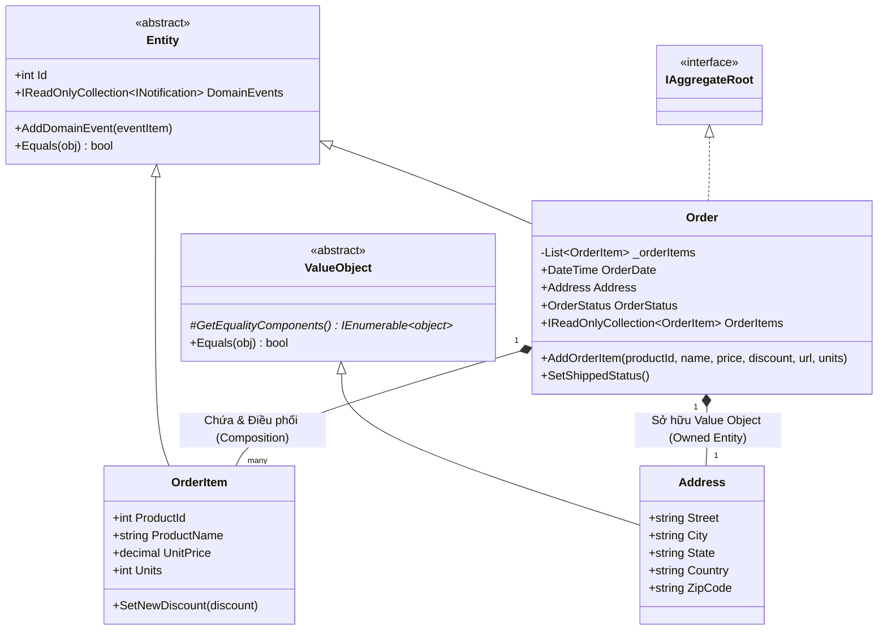
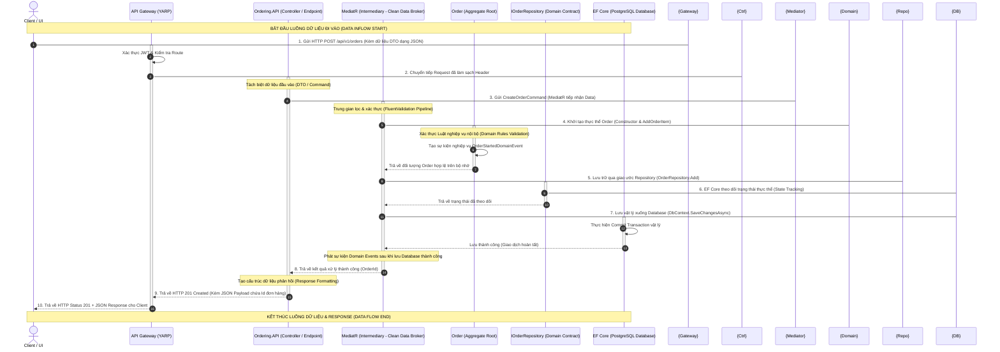

# BÁO CÁO PHÂN TÍCH CHUYÊN SÂU: THỰC THI THỰC TẾ CHI TẾT CÁC MẪU DDD (DOMAIN-DRIVEN DESIGN)

## CHỦ ĐỀ: GIẢI MÃ ENTITY, VALUE OBJECT, AGGREGATE VÀ REPOSITORY TRÊN CODEBASE eShop-main

> [!NOTE]
**Tài liệu nghiên cứu R&D thiết kế hệ thống cao cấp**
> 
> 
> **Dự án thực tế:** `eShop-main` (`src/Ordering.Domain/`)
> 
> **Mục tiêu:** Cung cấp định nghĩa học thuật chuẩn mực, trực quan hóa bằng sơ đồ Mermaid và chỉ ra mã nguồn thực tế chi tiết từng dòng trong eShop để bạn dễ dàng trình bày và phản biện xuất sắc trước Mentor.
> 

---

## MỤC LỤC

1. **Phần I: Tổng quan học thuật & Trực quan hóa Kiến trúc DDD**
    - 1.1. Sơ đồ cấu trúc Aggregate Root `Order` trong eShop
    - 1.2. Giải thích học thuật chuyên sâu: Domain-Driven Design (DDD) là gì?
    - 1.3. Sơ đồ Luồng Dữ liệu (Sequence Flow) & Mô tả quy trình đi/về của dữ liệu
    - 1.4. Đối chiếu So sánh toàn diện: Kiến trúc MVC vs. Domain-Driven Design (DDD)
    - 1.5. So sánh đối chiếu học thuật: Entity vs. Value Object
2. **Phần II: Phân tích chi tiết và đối chiếu mã nguồn nền tảng (SeedWork)**
    - 2.1. Lớp cơ sở `Entity.cs` - Cơ chế nhận diện & Quản lý Sự kiện miền (Domain Events)
    - 2.2. Lớp cơ sở `ValueObject.cs` - So sánh giá trị bằng cấu trúc thành phần (Structural Equality)
3. **Phần III: Thực thi cụ thể trong Phân hệ Đặt hàng (`src/Ordering.Domain/AggregatesModel/OrderAggregate/`)**
    - 3.1. `Order.cs` - Aggregate Root mẫu mực & Cơ chế đóng gói (Encapsulation) bảo vệ nghiệp vụ
    - 3.2. `Address.cs` - Thiết kế Value Object bất biến (Immutable Value Object)
    - 3.3. `OrderItem.cs` - Thực thể con (Child Entity) chịu sự quản lý của Aggregate Root
    - 3.4. `IOrderRepository.cs` - Hợp đồng Repository tại tầng Domain (Domain Repository Contract)
4. **Phần IV: Cẩm nang thuyết trình & Bản tự vệ phản biện trước Mentor**

---

# PHẦN I: TỔNG QUAN HỌC THUẬT & TRỰC QUAN HÓA KIẾN TRÚC DDD

Để hiểu rõ cách các đối tượng cộng tác với nhau, chúng ta bắt đầu bằng sơ đồ **Aggregate (Khối liên kết)** của phân hệ Đặt hàng (`OrderAggregate`) trong eShop.

### 1.1. Sơ đồ cấu trúc Aggregate Root `Order` trong eShop

Sơ đồ Mermaid dưới đây trực quan hóa ranh giới (Aggregate Boundary), nơi **Aggregate Root (`Order`)** đóng vai trò là “người gác cổng” bảo vệ tính toàn vẹn của tất cả các thực thể và đối tượng giá trị bên trong:



---

### 1.2. Giải thích học thuật chuyên sâu: Domain-Driven Design (DDD) là gì?

Domain-Driven Design (DDD) là một phương pháp luận phát triển phần mềm được giới thiệu bởi **Eric Evans** vào năm 2003. Khác với các phương pháp tiếp cận truyền thống vốn tập trung vào cơ sở dữ liệu (Database-Driven) hoặc công nghệ (Tech-Driven), DDD đặt **Mô hình miền (Domain Model)** và **Nghiệp vụ cốt lõi (Core Business Logic)** làm trọng tâm tối thượng của dự án.

DDD được chia làm hai phần cốt lõi:
* **Strategic Design (Thiết kế chiến lược):** Xác định ranh giới nghiệp vụ lớn qua **Bounded Context (Bối cảnh giới hạn)** và xây dựng ngôn ngữ chung **Ubiquitous Language** giữa lập trình viên và chuyên gia nghiệp vụ (Domain Expert).
* **Tactical Design (Thiết kế kỹ thuật):** Cung cấp các mẫu thiết kế cụ thể để thực thi mã nguồn sạch như *Entity, Value Object, Aggregate Root, Domain Event, Service, và Repository*.

### 💡 Tích hợp định nghĩa thực tế của bạn:

> *“Domain-Driven Design là một dạng các service có domain riêng, chúng sẽ giao tiếp qua một cái gì đó trung gian để tiếp nhận data sạch.”*
> 

Định nghĩa mang tính trực giác này của bạn phản ánh rất chính xác kiến trúc DDD nâng cao kết hợp Microservices:
1. **“Các service có domain riêng”:** Chính là khái niệm **Bounded Context**. Mỗi dịch vụ (ví dụ: `Ordering`, `Catalog`, `Basket`) tự quản lý hoàn toàn mô hình dữ liệu và nghiệp vụ riêng biệt của mình, không bị xâm phạm bởi các dịch vụ khác.
2. **“Giao tiếp qua cái gì đó trung gian”:** Đó là vai trò của các **Application Services (MediatR / Command Handlers)** ở cấp độ ứng dụng, hoặc **Anti-Corruption Layer (ACL - Lớp chống tham nhũng dữ liệu)**, **API Gateway**, hoặc **Message Broker / Event Bus** ở cấp độ hệ thống.
3. **“Tiếp nhận data sạch”:** Dữ liệu thô từ bên ngoài (Client Request / HTTP JSON) là dữ liệu chưa an toàn. Khi qua lớp “trung gian” (như `Pipeline Behavior` xác thực dữ liệu của MediatR kết hợp `FluentValidation` và các `DTO/Command` chặt chẽ), dữ liệu sẽ được lọc sạch, giải mã cấu trúc và kiểm tra tính hợp lệ trước khi được đưa vào sâu trong **Domain Model** để thực thi. Điều này giúp Domain Model hoàn toàn được bảo vệ và chỉ làm việc với những dữ liệu “sạch” tuyệt đối, đúng luật nghiệp vụ.

---

### 1.3. Sơ đồ Luồng Dữ liệu (Sequence Flow) & Mô tả quy trình đi/về của dữ liệu

Để giúp bạn giải thích cặn kẽ cho người khác dữ liệu bắt đầu từ đâu, đi qua những đâu, kết thúc ở đâu và phản hồi trả về ra sao, hãy theo dõi sơ đồ tuần tự dưới đây biểu diễn quy trình **Tạo Đơn Hàng mới (`Create Order`)** trong phân hệ `Ordering` của eShop:



### 📌 Phân tích đường đi chi tiết của Luồng dữ liệu (Dùng để thuyết trình):

1. **Điểm bắt đầu (Start):** Luồng dữ liệu bắt đầu từ **Client (Trình duyệt/Mobile app)** thông qua yêu cầu gửi đi HTTP POST mang JSON Payload thô chứa thông tin giỏ hàng, người mua và địa chỉ.
2. **Bộ lọc trung gian (Intermediary):**
    - **API Gateway (YARP):** Lọc các header độc hại, xác thực danh tính người dùng (JWT) trước khi định tuyến request vào microservice cụ thể.
    - **MediatR & Pipeline Behavior:** Đây chính là **“Trung gian tiếp nhận data sạch”**. Dữ liệu thô từ HTTP Request được ánh xạ thành một `Command` (một dạng DTO). MediatR sẽ chạy một Pipeline Validation ngầm (bằng `FluentValidation`) để kiểm tra cú pháp (ví dụ: ZipCode phải đúng định dạng, số lượng mặt hàng > 0). Nếu phát hiện lỗi, nó sẽ lập tức ném ra lỗi ngoại lệ để phản hồi về Client, không cho phép dữ liệu bẩn chạm tới tầng Domain.
3. **Tầng xử lý nghiệp vụ sâu (Domain Core):**
    - Nếu dữ liệu đã sạch, `CommandHandler` kích hoạt **Aggregate Root (`Order`)** thông qua Constructor nghiệp vụ. Lớp `Order` tiếp tục kiểm tra các luật miền nâng cao (ví dụ: Khách hàng này có bị khóa tài khoản không, chiết khấu có hợp lệ không). Nếu hợp lệ, trạng thái thực thể được thiết lập.
4. **Điểm kết thúc (End - Persistence):**
    - Dữ liệu được chuyển qua giao ước Repository `IOrderRepository` (Tầng Domain thiết lập giao ước, tầng Infrastructure thực thi thông qua EF Core).
    - Khi lệnh `SaveChangesAsync()` được thực thi thành công, giao dịch (Transaction) được commit xuống **PostgreSQL Database** vật lý. Dữ liệu chính thức được lưu trữ bền vững.
5. **Luồng phản hồi trả về (Response Flow):**
    - Sau khi lưu DB thành công, mã định danh duy nhất của đơn hàng (`OrderId`) được trả ngược từ Database lên Repository, qua Mediator về Controller.
    - **Controller** đóng gói kết quả và trả về cho Client mã trạng thái chuẩn **HTTP 201 Created** kèm theo JSON payload chứa `OrderId` mới tạo. Nếu có lỗi xảy ra ở bất kỳ bước nào, hệ thống sẽ trả về mã **HTTP 400 Bad Request** hoặc **HTTP 500 Internal Server Error** dưới cấu trúc **ProblemDetails** tiêu chuẩn (đáp ứng đúng yêu cầu thiết kế API sạch).

---

### 1.4. Đối chiếu So sánh toàn diện: Kiến trúc MVC vs. Domain-Driven Design (DDD)

Để giải thích lý do tại sao mô hình MVC lại vô cùng phổ biến, trong khi DDD dù rất tốt và nghiêm ngặt nhưng chỉ nên áp dụng cho hệ thống lớn, chúng ta đặt hai mô hình lên bàn cân đối chiếu:

```
        ┌────────────────────────────────────────────────────────┐
        │              KIẾN TRÚC MVC vs. KIẾN TRÚC DDD           │
        ├───────────────────────────┬────────────────────────────┤
        │  MÔ HÌNH MVC TRUYỀN THỐNG │   MÔ HÌNH DDD / CLEAN ARCH │
        ├───────────────────────────┼────────────────────────────┤
        │ 🟢 Phát triển siêu nhanh  │ 🟡 Tốn nhiều code nền tảng │
        │ 🟢 Ít file, cấu trúc đơn  │ 🟡 Đường cong học tập dốc  │
        │    giản, dễ tiếp cận      │    (Boilerplate code lớn)  │
        │ 🔴 Dễ bị phình to         │ 🟢 Giữ cho Core Business   │
        │    (Anemic Domain Model)  │    luôn sạch, dễ bảo trì   │
        │ 🔴 Khó viết Unit Test cho │ 🟢 Viết Unit Test cực dễ   │
        │    nghiệp vụ phức tạp     │    vì Domain không phụ thuộc│
        └───────────────────────────┴────────────────────────────┘
```

### A. Tại sao mô hình MVC (Model-View-Controller) lại được sử dụng phổ biến nhất?

1. **Sự đơn giản tối đa:** MVC chia ứng dụng thành 3 phần rõ ràng. Luồng đi trực diện từ Controller -> gọi Database (hoặc Service mỏng) -> Trả về View. Lập trình viên mới bắt đầu chỉ cần vài giờ là có thể nắm bắt và tạo ra một sản phẩm chạy được.
2. **Tốc độ phát triển thần tốc (Time-to-market):** Với các hệ thống vừa và nhỏ, nghiệp vụ chủ yếu xoay quanh các tác vụ CRUD (Thêm, Đọc, Sửa, Xóa đơn giản), MVC giúp tiết kiệm tối đa thời gian. Bạn không cần viết hàng chục interface, hàng chục class trung gian như DDD mà có thể thao tác trực tiếp với Database.
3. **Tối ưu chi phí cấu hình nền tảng:** Không có “đòn bẩy” kiến trúc phức tạp (như MediatR, Domain Events, Aggregate Boundary), hệ thống nhẹ nhàng, dễ triển khai và chi phí vận hành ban đầu cực thấp.

### B. Tại sao DDD tuy rất tốt nhưng chỉ khuyên dùng cho các hệ thống lớn và phức tạp?

1. **Chi phí thiết kế ban đầu cực cao:** DDD đòi hỏi sự đầu tư rất lớn về cả tư duy và công sức ngay từ giai đoạn đầu. Việc xác định Bounded Context, làm việc với Domain Expert để thống nhất Ubiquitous Language tốn rất nhiều thời gian.
2. **Sự phình to của mã nguồn nền tảng (Boilerplate Code):** Để tạo ra một chức năng đơn giản trong DDD, bạn bắt buộc phải viết: `Command`, `CommandHandler`, `DomainEvent`, `AggregateRoot validation`, `Repository Interface`, `Repository Implementation`, `Entity base class`… Điều này làm nản lòng các đội ngũ phát triển dự án nhỏ vì “viết code nền tảng nhiều hơn code nghiệp vụ thực tế”.
3. **Đòi hỏi trình độ lập trình viên cao:** Lập trình viên phải hiểu rõ về tính đóng gói, sự bất biến của Value Object, ranh giới giao dịch của Aggregate. Nếu áp dụng DDD sai cách, bạn sẽ tạo ra một hệ thống “thảm họa” - vừa phức tạp, khó hiểu, vừa có hiệu năng kém (do nạp dữ liệu thừa qua Aggregate).
4. **Quy luật độ phức tạp nghiệp vụ (The Domain Complexity Rule):**
    - Nếu nghiệp vụ của bạn đa số chỉ là **CRUD**, sử dụng DDD là **“Overkill”** (dùng dao mổ trâu để giết gà).
    - Chỉ khi nghiệp vụ của bạn có **quy trình phức tạp, thay đổi trạng thái liên tục theo nhiều quy luật chồng chéo** (như hệ thống lõi ngân hàng, thương mại điện tử quy mô lớn như eShop, phân hệ logistics…), DDD mới phát huy sức mạnh vượt trội giúp hệ thống không bị đổ sụp theo thời gian (Tránh được lỗi *Big Ball of Mud* - Bãi bùn lầy kiến trúc).

---

### 1.5. So sánh đối chiếu học thuật: Entity vs. Value Object

Dưới đây là bảng so sánh học thuật chuẩn mực, giúp bạn dễ dàng thuyết trình trực quan trước Mentor:

| Đặc tính | Thực thể (Entity) | Đối tượng giá trị (Value Object) |
| --- | --- | --- |
| **Định danh (Identity)** | Có định danh duy nhất (`Id`) duy trì xuyên suốt vòng đời. | Không có định danh riêng (`No Id`). |
| **Vòng đời & Trạng thái** | Có vòng đời độc lập, trạng thái có thể thay đổi liên tục (`Mutable`). | Không có vòng đời độc lập, là đối tượng bất biến (`Immutable`). |
| **Cơ chế so sánh** | So sánh bằng thuộc tính định danh vật lý (`Id`). | So sánh bằng toàn bộ giá trị các thuộc tính cấu thành (`Structural Equality`). |
| **Cách thay đổi giá trị** | Thay đổi giá trị các trường nội bộ của thực thể hiện tại. | Tạo một đối tượng Value Object mới thay thế hoàn toàn đối tượng cũ. |
| **Sự phụ thuộc** | Có thể tồn tại độc lập hoặc là gốc liên kết (`Aggregate Root`). | Hoàn toàn phụ thuộc và thuộc sở hữu của một Entity (`Owned Attribute`). |
| **Ví dụ thực tế** | Đơn hàng (`Order`), Khách hàng (`Buyer`), Sản phẩm (`CatalogItem`). | Địa chỉ (`Address`), Khoảng tiền (`Money`), Màu sắc (`Color`). |

### A. Định nghĩa học thuật chuẩn Eric Evans:

- **Thực thể (Entity):** Là một đối tượng miền có **Định danh duy nhất (Identity - Id)** và định danh này được duy trì xuyên suốt vòng đời của nó, không quan tâm đến sự thay đổi của các thuộc tính khác.
    - *Ví dụ:* Một đơn hàng (`Order`) có ID là `10025`. Cho dù trạng thái đơn hàng thay đổi từ `Submitted` sang `Shipped`, địa chỉ giao hàng bị sửa, nó vẫn là đơn hàng `10025`.
- **Đối tượng giá trị (Value Object):** Là một đối tượng đại diện cho một **Khái niệm mang tính mô tả** trong miền, không có định danh duy nhất (No Identity). Nó hoàn toàn được định nghĩa bởi tập hợp tất cả các giá trị thuộc tính cấu thành. Đặc tính quan trọng nhất của Value Object là **Tính bất biến (Immutability)**.
    - *Ví dụ:* Địa chỉ giao hàng (`Address`) gồm các thuộc tính `Street`, `City`, `ZipCode`. Nếu bạn muốn đổi địa chỉ, bạn không sửa thuộc tính của địa chỉ cũ mà bạn **tạo ra một đối tượng `Address` mới hoàn toàn** để thay thế. Hai địa chỉ được coi là bằng nhau nếu mọi thuộc tính cấu thành của chúng giống hệt nhau.
- **Aggregate & Aggregate Root (Khối liên kết & Gốc liên kết):**
    - **Aggregate:** Là một cụm các đối tượng (Entities và Value Objects) liên kết chặt chẽ với nhau, được coi là một đơn vị giao dịch dữ liệu duy nhất (Transactional Consistency Boundary).
    - **Aggregate Root:** Là thực thể duy nhất nằm trong Aggregate được phép lộ diện ra thế giới bên ngoài. Mọi truy cập, chỉnh sửa các thực thể con bên trong Aggregate bắt buộc phải đi qua Aggregate Root. Bên ngoài không được phép tự ý thay đổi dữ liệu của các con mà không thông qua Root.
- **Repository (Kho chứa dữ liệu):**
    - Là một mẫu thiết kế đóng vai trò như một **Bộ sưu tập thực thể trong bộ nhớ (In-memory collection)**. Nó cung cấp các giao thức để thêm, cập nhật, xóa và truy vấn các Aggregate Root.
    - *Nguyên tắc tối thượng:* **Chỉ có các Aggregate Root mới có Repository riêng biệt**. Các thực thể con (như `OrderItem`) không bao giờ có Repository riêng, chúng phải được lưu trữ/truy vấn gián tiếp thông qua Repository của Aggregate Root tương ứng (`OrderRepository`).

---

# PHẦN II: PHÂN TÍCH CHI TIẾT & ĐỐI CHIẾU MÃ NGUỒN NỀN TẢNG (SEEDWORK)

Để xây dựng một hệ thống Domain sạch, eShop thiết lập các lớp cơ sở trừu tượng nằm trong thư mục `src/Ordering.Domain/SeedWork/`. Đây chính là “xương sống” cho toàn bộ thực thi phía sau.

### 2.1. Lớp cơ sở `Entity.cs` - Nhận diện định danh & Domain Events

Đường dẫn tệp tin: [src/Ordering.Domain/SeedWork/Entity.cs](file:///d:/Subagent/Nhom_10_DevOps_Testing_Production/eShop-main/src/Ordering.Domain/SeedWork/Entity.cs)

Lớp `Entity` định nghĩa cơ chế so sánh thực thể bằng định danh `Id` vật lý và tích hợp sẵn cơ chế phát sinh sự kiện nghiệp vụ (**Domain Events**):

```csharp
public abstract class Entity
{
    int? _requestedHashCode;
    int _Id;
    public virtual int Id
    {
        get => _Id;
        protected set => _Id = value; // Setter được bảo vệ (protected), chỉ gán nội bộ
    }

    // 1. Quản lý danh sách Domain Events phát sinh
    private List<INotification> _domainEvents;
    public IReadOnlyCollection<INotification> DomainEvents => _domainEvents?.AsReadOnly();

    public void AddDomainEvent(INotification eventItem)
    {
        _domainEvents ??= new List<INotification>();
        _domainEvents.Add(eventItem); // Lưu giữ sự kiện cho đến khi DbContext.SaveChanges() thành công
    }

    // 2. Định nghĩa so sánh ngang hàng (Structural Equality cho Entity = So sánh ID)
    public override bool Equals(object obj)
    {
        if (obj == null || !(obj is Entity))
            return false;

        if (Object.ReferenceEquals(this, obj))
            return true;

        if (this.GetType() != obj.GetType())
            return false;

        Entity item = (Entity)obj;

        if (item.IsTransient() || this.IsTransient())
            return false; // Đối tượng chưa lưu xuống DB (Transient) thì không so sánh bằng ID
        else
            return item.Id == this.Id; // So sánh bằng thuộc tính Id duy nhất
    }
}
```

---

### 2.2. Lớp cơ sở `ValueObject.cs` - So sánh giá trị cấu thành

Đường dẫn tệp tin: [src/Ordering.Domain/SeedWork/ValueObject.cs](file:///d:/Subagent/Nhom_10_DevOps_Testing_Production/eShop-main/src/Ordering.Domain/SeedWork/ValueObject.cs)

Vì Value Object không có ID, nên việc so sánh hai Value Object bắt buộc phải duyệt qua tất cả các thuộc tính của chúng. Lớp trừu tượng `ValueObject` tự động hóa việc này bằng cách bắt các lớp con định nghĩa phương thức `GetEqualityComponents()`:

```csharp
public abstract class ValueObject
{
    // Bắt buộc lớp con phải trả về danh sách các thuộc tính cấu thành giá trị
    protected abstract IEnumerable<object> GetEqualityComponents();

    public override bool Equals(object obj)
    {
        if (obj == null || obj.GetType() != GetType())
        {
            return false;
        }

        var other = (ValueObject)obj;

        // So sánh tuần tự (SequenceEqual) mọi giá trị thuộc tính của 2 đối tượng
        return this.GetEqualityComponents().SequenceEqual(other.GetEqualityComponents());
    }

    public override int GetHashCode()
    {
        // Tạo mã Hash đại diện bằng cách thực hiện phép toán XOR (^) giữa mã hash của các thuộc tính
        return GetEqualityComponents()
            .Select(x => x != null ? x.GetHashCode() : 0)
            .Aggregate((x, y) => x ^ y);
    }
}
```

---

# PHẦN III: THỰC THI THỰC TẾ TRONG PHÂN HỆ ĐẶT HÀNG (`OrderAggregate`)

Hãy cùng mổ xẻ mã nguồn thực tế tại thư mục `src/Ordering.Domain/AggregatesModel/OrderAggregate/` để xem eShop áp dụng các nguyên lý này tinh tế như thế nào.

### 3.1. `Order.cs` - Aggregate Root mẫu mực & Cơ chế đóng gói (Encapsulation)

Đường dẫn tệp tin: [src/Ordering.Domain/AggregatesModel/OrderAggregate/Order.cs](file:///d:/Subagent/Nhom_10_DevOps_Testing_Production/eShop-main/src/Ordering.Domain/AggregatesModel/OrderAggregate/Order.cs)

Lớp `Order` kế thừa từ `Entity` và triển khai Interface đánh dấu `IAggregateRoot`. Hãy chú ý cách nó bảo vệ tính đóng gói của danh sách sản phẩm bên trong đơn hàng:

```csharp
public class Order : Entity, IAggregateRoot
{
    public DateTime OrderDate { get; private set; }

    // Address là một Value Object
    [Required]
    public Address Address { get; private set; }

    public OrderStatus OrderStatus { get; private set; }

    // DDD Pattern: Sử dụng một trường private List để bảo vệ đóng gói
    private readonly List<OrderItem> _orderItems;

    // Bên ngoài chỉ được phép đọc thông qua IReadOnlyCollection, KHÔNG THỂ gọi .Add() hay .Remove() trực tiếp
    public IReadOnlyCollection<OrderItem> OrderItems => _orderItems.AsReadOnly();

    protected Order()
    {
        _orderItems = new List<OrderItem>();
    }

    // DDD Pattern: Việc thêm phần tử vào đơn hàng BẮT BUỘC phải đi qua cửa ngõ AddOrderItem của Root
    public void AddOrderItem(int productId, string productName, decimal unitPrice, decimal discount, string pictureUrl, int units = 1)
    {
        // 1. Kiểm tra nghiệp vụ: Nếu sản phẩm đã tồn tại trong giỏ hàng, chỉ cập nhật số lượng và chiết khấu tốt nhất
        var existingOrderForProduct = _orderItems.SingleOrDefault(o => o.ProductId == productId);

        if (existingOrderForProduct != null)
        {
            if (discount > existingOrderForProduct.Discount)
            {
                existingOrderForProduct.SetNewDiscount(discount); // Nghiệp vụ bảo vệ chiết khấu tốt nhất cho khách
            }
            existingOrderForProduct.AddUnits(units);
        }
        else
        {
            // 2. Thêm mới một thực thể con (OrderItem) đã được xác thực an toàn
            var orderItem = new OrderItem(productId, productName, unitPrice, discount, pictureUrl, units);
            _orderItems.Add(orderItem);
        }
    }

    // Nghiệp vụ thay đổi trạng thái đơn hàng kiểm soát chặt chẽ trạng thái chuyển đổi
    public void SetShippedStatus()
    {
        if (OrderStatus != OrderStatus.Paid)
        {
            throw new OrderingDomainException($"Không thể chuyển trạng thái sang Shipped khi đơn hàng chưa thanh toán!");
        }

        OrderStatus = OrderStatus.Shipped;
        Description = "Đơn hàng đã được xuất kho vận chuyển.";
        AddDomainEvent(new OrderShippedDomainEvent(this)); // Phát đi Domain Event
    }
}
```

---

### 3.2. `Address.cs` - Thiết kế Value Object bất biến (Immutable Value Object)

Đường dẫn tệp tin: [src/Ordering.Domain/AggregatesModel/OrderAggregate/Address.cs](file:///d:/Subagent/Nhom_10_DevOps_Testing_Production/eShop-main/src/Ordering.Domain/AggregatesModel/OrderAggregate/Address.cs)

Lớp `Address` kế thừa từ `ValueObject`. Tất cả các thuộc tính của nó đều có setter là `private`. Đối tượng chỉ được gán giá trị một lần duy nhất tại hàm dựng (Constructor):

```csharp
public class Address : ValueObject
{
    // Tất cả thuộc tính có setter là 'private' -> Bất biến (Immutable)
    public string Street { get; private set; }
    public string City { get; private set; }
    public string State { get; private set; }
    public string Country { get; private set; }
    public string ZipCode { get; private set; }

    public Address() { } // Constructor mặc định cho EF Core ORM nạp dữ liệu

    public Address(string street, string city, string state, string country, string zipcode)
    {
        Street = street;
        City = city;
        State = state;
        Country = country;
        ZipCode = zipcode;
    }

    // Chỉ định các trường tham gia vào so sánh ngang hàng
    protected override IEnumerable<object> GetEqualityComponents()
    {
        yield return Street;
        yield return City;
        yield return State;
        yield return Country;
        yield return ZipCode;
    }
}
```

---

### 3.3. `OrderItem.cs` - Thực thể con (Child Entity)

Đường dẫn tệp tin: [src/Ordering.Domain/AggregatesModel/OrderAggregate/OrderItem.cs](file:///d:/Subagent/Nhom_10_DevOps_Testing_Production/eShop-main/src/Ordering.Domain/AggregatesModel/OrderAggregate/OrderItem.cs)

`OrderItem` kế thừa từ `Entity` (nó có ID nội bộ riêng), nhưng nó không phải Aggregate Root. Nó không thể tồn tại độc lập mà hoàn toàn phụ thuộc vào sự sinh tồn của `Order`:

```csharp
public class OrderItem : Entity
{
    [Required]
    public string ProductName { get; private set; }
    public string PictureUrl { get; private set; }
    public decimal UnitPrice { get; private set; }
    public decimal Discount { get; private set; }
    public int Units { get; private set; }
    public int ProductId { get; private set; }

    protected OrderItem() { }

    // Constructor được bảo vệ, chỉ được tạo ra thông qua các nghiệp vụ của Aggregate Root (Order)
    public OrderItem(int productId, string productName, decimal unitPrice, decimal discount, string pictureUrl, int units = 1)
    {
        if (units <= 0)
        {
            throw new OrderingDomainException("Số lượng sản phẩm đặt hàng phải lớn hơn 0 (Invalid number of units).");
        }

        if ((unitPrice * units) < discount)
        {
            throw new OrderingDomainException("Tổng số tiền sản phẩm không được nhỏ hơn chiết khấu được áp dụng.");
        }

        ProductId = productId;
        ProductName = productName;
        UnitPrice = unitPrice;
        Discount = discount;
        Units = units;
        PictureUrl = pictureUrl;
    }

    public void AddUnits(int units)
    {
        if (units < 0)
        {
            throw new OrderingDomainException("Số lượng thêm vào không hợp lệ (Invalid units).");
        }
        Units += units;
    }

    public void SetNewDiscount(decimal discount)
    {
        if (discount < 0)
        {
            throw new OrderingDomainException("Chiết khấu không hợp lệ (Discount is not valid).");
        }
        Discount = discount;
    }
}
```

---

### 3.4. `IOrderRepository.cs` - Hợp đồng Repository tại tầng Domain

Đường dẫn tệp tin: [src/Ordering.Domain/AggregatesModel/OrderAggregate/IOrderRepository.cs](file:///d:/Subagent/Nhom_10_DevOps_Testing_Production/eShop-main/src/Ordering.Domain/AggregatesModel/OrderAggregate/IOrderRepository.cs)

Định nghĩa interface chứa các giao thức nghiệp vụ. Chỉ Aggregate Root `Order` mới có Repository. Tầng Infrastructure (EF Core) sẽ implement interface này:

```csharp
// Kế thừa IRepository<Order>, chỉ quản lý Aggregate Root Order
public interface IOrderRepository : IRepository<Order>
{
    Order Add(Order order);

    void Update(Order order);

    Task<Order> GetAsync(int orderId); // Lấy toàn bộ đơn hàng kèm các thực thể con lên bộ nhớ
}
```

---

# PHẦN IV: CẨM NANG THUYẾT TRÌNH & BẢN TỰ VỆ PHẢN BIỆN TRƯỚC MENTOR

Để bảo vệ thành công báo cáo này và gây ấn tượng mạnh với Mentor, bạn hãy ghi nhớ **3 kịch bản phản biện đối kháng** dưới đây:

### 💬 Kịch bản 1: Mentor hỏi: *“Tại sao OrderItem là Entity còn Address lại là Value Object? Sao không làm Address thành Entity luôn cho dễ?”*

- **Bản tự vệ phản biện:**
> “Thưa anh/chị, đây là quyết định tối ưu hóa kiến trúc dựa trên vòng đời và nhận diện.
> * `OrderItem` bắt buộc phải là một Entity vì nó có vòng đời độc lập bên trong giỏ hàng. Một đơn hàng có thể có nhiều `OrderItem` của cùng một loại sản phẩm nhưng khác nhau về thời điểm thêm vào, chiết khấu hoặc trạng thái cụ thể, và chúng ta cần theo dõi chi tiết từng dòng mặt hàng này.
> * Ngược lại, `Address` hoàn toàn chỉ mang tính mô tả địa chỉ giao hàng tại thời điểm đặt. Nó không có vòng đời riêng. Nếu khách hàng muốn đổi địa chỉ giao hàng, chúng ta không chỉnh sửa thuộc tính của địa chỉ cũ mà tạo ra một đối tượng `Address` hoàn toàn mới để ghi đè. Điều này giúp ngăn chặn hoàn toàn lỗi bất đồng bộ dữ liệu (Side-effects) và giữ cho lịch sử đơn hàng luôn chính xác tuyệt đối.”

### 💬 Kịch bản 2: Mentor hỏi: *“Tôi thấy trong lớp `Order`, danh sách `OrderItems` được phơi ra ngoài dưới dạng `IReadOnlyCollection<OrderItem>`. Tại sao không dùng `List<OrderItem>` cho tiện gọi hàm `.Add()` ở bên ngoài?”*

- **Bản tự vệ phản biện:**
> “Đây là nguyên tắc **Bảo vệ tính đóng gói và bất biến của Aggregate Root** trong DDD.
>
> Nếu chúng ta phơi ra dạng `List<OrderItem>`, bất kỳ đoạn code nào ở tầng Application (ví dụ: một Service hoặc một Controller) cũng có thể tự ý gọi `order.OrderItems.Add(newItem)` hoặc `.Clear()` trực tiếp mà không cần đi qua lớp nghiệp vụ của `Order`.
>
> Điều này sẽ phá vỡ hoàn toàn các quy tắc kiểm tra nghiệp vụ (Validation) của Aggregate Root (ví dụ: kiểm tra trùng lặp sản phẩm, kiểm tra số lượng đặt phải lớn hơn 0, cập nhật chiết khấu tối ưu…). Bằng cách ép kiểu sang `IReadOnlyCollection`, chúng ta bắt buộc mọi thao tác sửa đổi phải đi qua cửa ngõ duy nhất là hàm `Order.AddOrderItem()`, đảm bảo dữ liệu trong Aggregate luôn luôn nhất quán và hợp lệ.”

### 💬 Kịch bản 3: Mentor hỏi: *“Tại sao không tạo một tệp `IOrderItemRepository.cs` để lưu trực tiếp các dòng sản phẩm cho nhanh?”*

- **Bản tự vệ phản biện:**
> “Trong DDD, **chỉ có Aggregate Root mới được phép sở hữu Repository**.
>
> `OrderItem` là một thực thể con phụ thuộc (Child Entity) nằm bên trong ranh giới giao dịch (Transaction Boundary) của `Order`. Nếu chúng ta tạo một Repository riêng cho `OrderItem` và cho phép lưu trữ/xóa nó độc lập, chúng ta sẽ tự tạo ra nguy cơ dữ liệu bất nhất (ví dụ: tổng tiền của đơn hàng không khớp với tổng tiền của các dòng sản phẩm bên trong).
>
> Mọi thay đổi của `OrderItem` bắt buộc phải được theo dõi, xử lý và lưu xuống database thông qua giao dịch nhất quán của Aggregate Root mẹ là `Order` thông qua `IOrderRepository`. Điều này giúp đảm bảo tính toàn vẹn dữ liệu tuyệt đối ở cấp độ Database.”